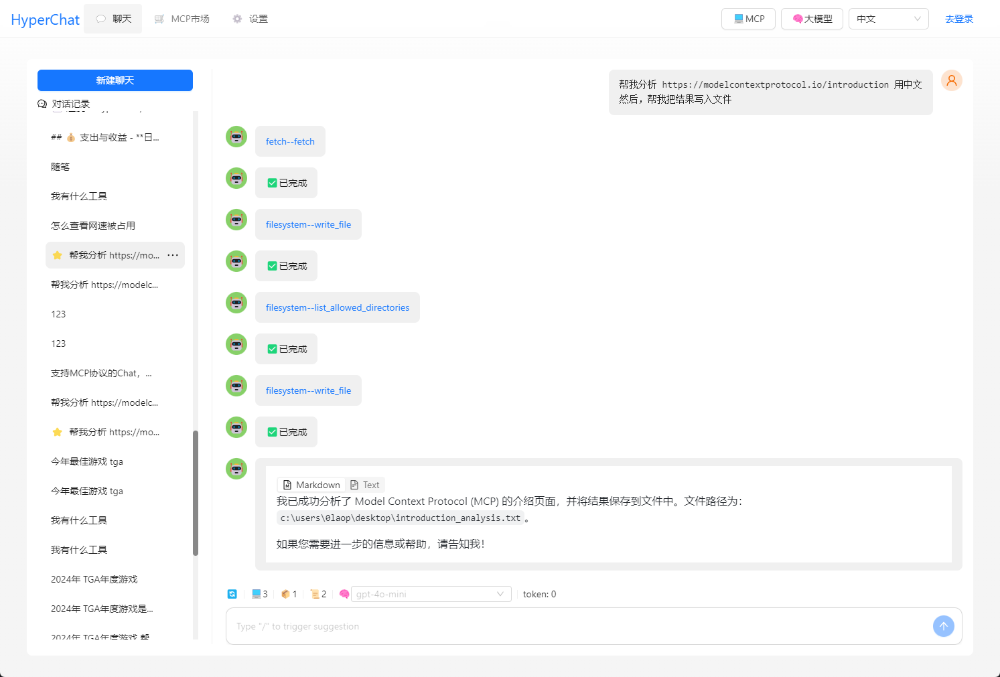
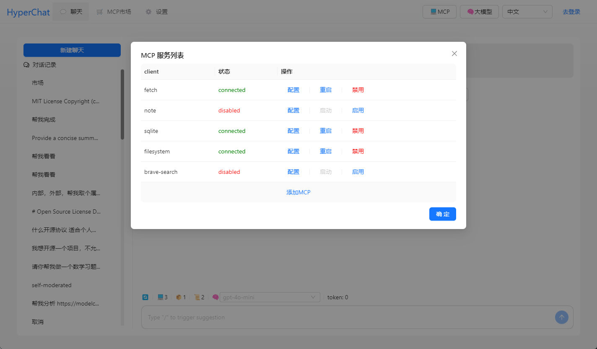
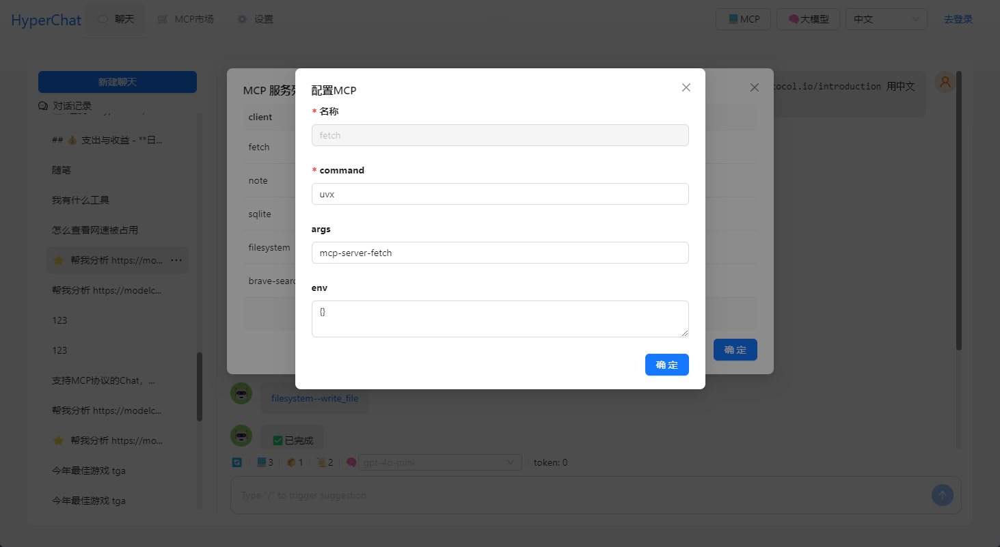

## 背景

MCP出来后感觉这个很有搞头，本来想开发一个工具箱，给MCP使用的，但是`Claude Desktop`一老封号，只能自己开发一个Chat了。已经开源。

## 功能

支持MCP协议的Chat，使用OpenAI的协议，兼容 `Claude Desktop` 配置文件。支持 `Client` 热加载，重启，禁用。

### MCP: 

[](https://github.com/BigSweetPotatoStudio/HyperChat/actions/workflows/build.yml)

- [x] 🪟Windows+🍏MacOS
- [x] 支持 `nvm`, 看下面
- [x] Resources 支持
- [x] Prompts 部分支持
- [x] Tools 支持


## 使用

* 1.需要配置你的OpenAI风格的APIKEY
* 2.确保您的系统中已安装 uvx 或 npx。


```
# uvx
brew install uv

# npx
brew install node 
```

## 开发

```
cd electron && npm install
cd web && npm install
npm run dev
```


## 注意

MacOS `nvm` 用户 手动输入PATH `echo $PATH`, windows版本 `nvm` 好像可以直接使用


## Telegram

[HyperChat用户交流](https://t.me/dadigua001)









