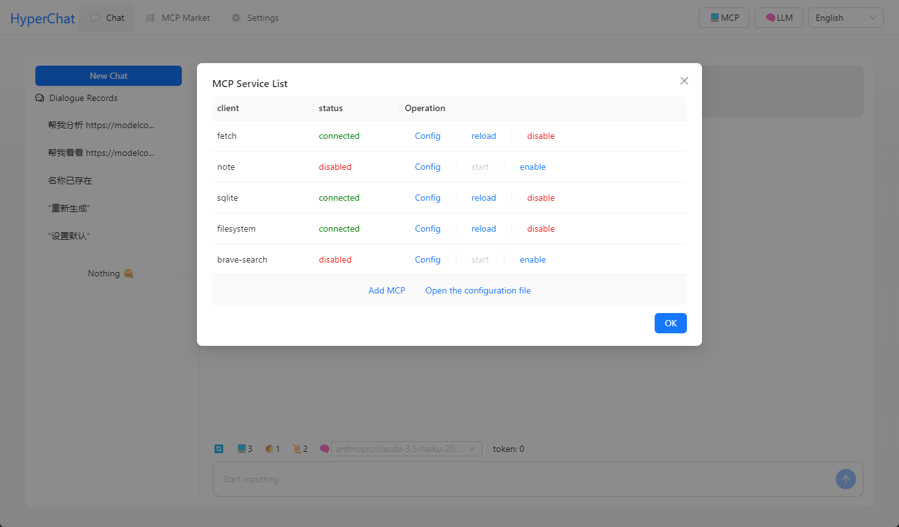
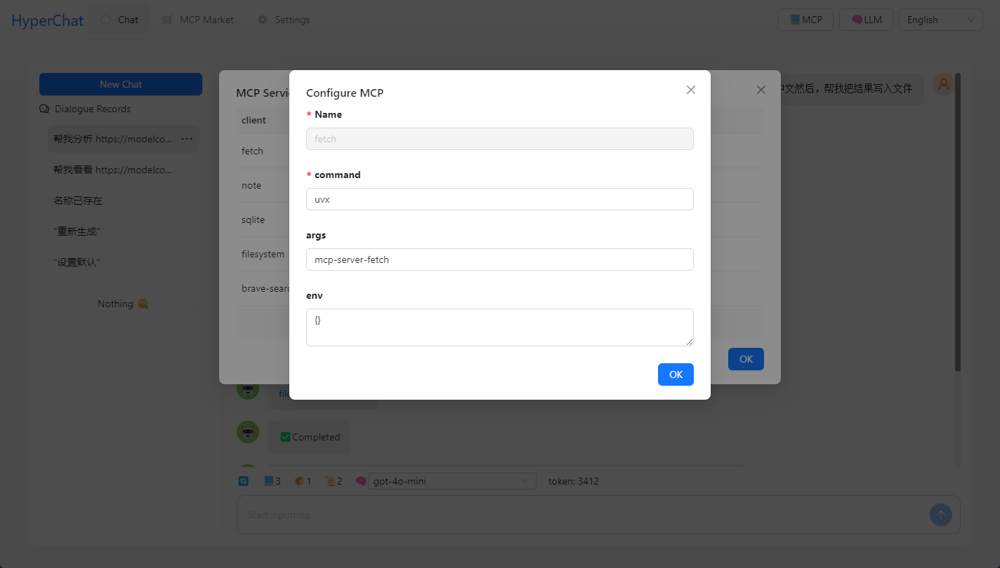

[中文](README.zh.md) | [English](README.md)


## Background

After the release of [MCP](https://modelcontextprotocol.io/introduction), I felt it was quite promising. I originally planned to develop a toolbox for MCP, but since `Claude Desktop` keeps getting banned, I had to develop a Chat myself. It has been open-sourced.

## Features

A Chat that supports the MCP protocol, using the OpenAI protocol and compatible with `Claude Desktop` configuration files. Supports `Client` hot loading, restart, and disable.

### MCP:

[](https://github.com/BigSweetPotatoStudio/HyperChat/actions/workflows/build.yml)

- [x] 🪟Windows + 🍏MacOS
- [x] Supports `nvm`, see below
- [x] Resource support
- [x] Partial support for Prompts
- [x] Tools support
- [x] Supports English and Chinese

## Usage

* 1. You need to configure your OpenAI style APIKEY
* 2. Ensure that uvx or npx is installed on your system.

### [uvx](https://github.com/astral-sh/uv)

```
brew install uv
```
### [npx & nodejs](https://nodejs.org/en)

```
brew install node 
```

## Development

```
cd electron && npm install
cd web && npm install
npm run dev
```

## Note

* MacOS may encounter damage or permission issues, `sudo xattr -d com.apple.quarantine /Applications/HyperChat.app`
* For MacOS `nvm` users, manually input PATH `echo $PATH`, it seems the Windows version of `nvm` can be used directly


## Telegram

[HyperChat User Communication](https://t.me/dadigua001)




