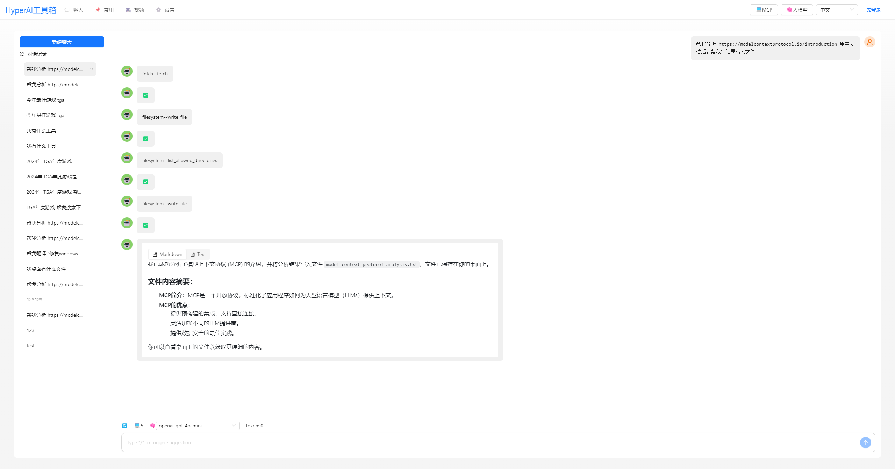
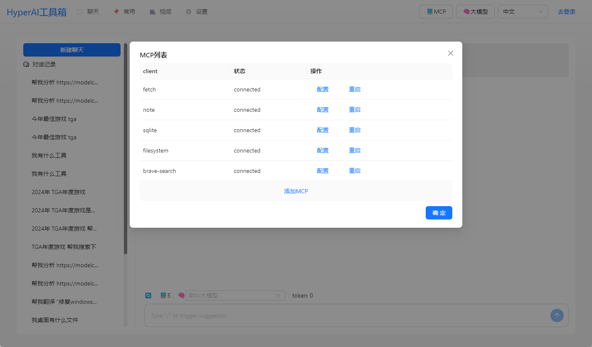
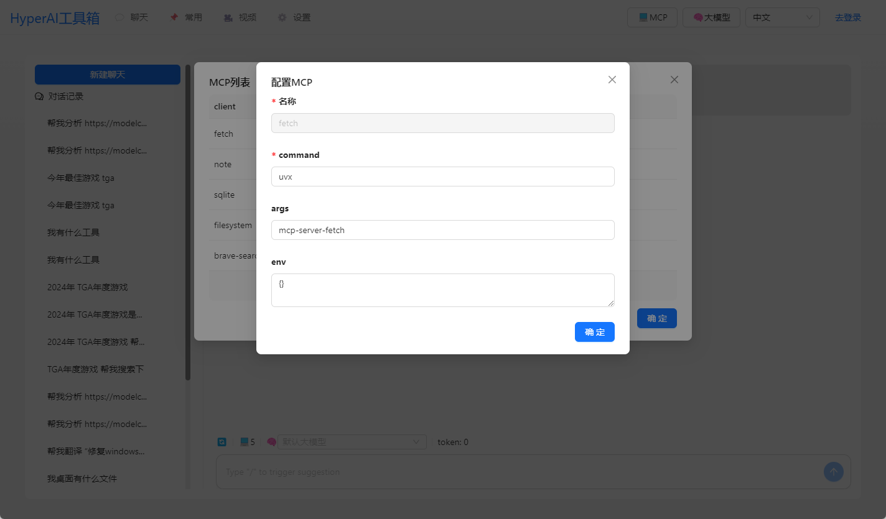

## 背景

MCP出来后感觉这个很有搞头，本来想开发一个工具箱，给MCP使用的，但是`Claude Desktop`一老封号，只能自己开发一个Chat了。暂时不开源，代码还需要整理，抽出来。

## 功能

支持MCP协议的Chat，使用OpenAI的协议，兼容 `Claude Desktop` 配置文件。支持 `Client` 热加载，重启。

## Telegram

[HyperChat](https://t.me/dadigua001)

