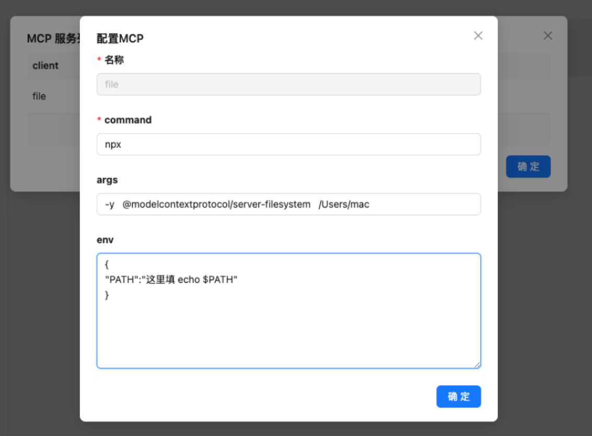
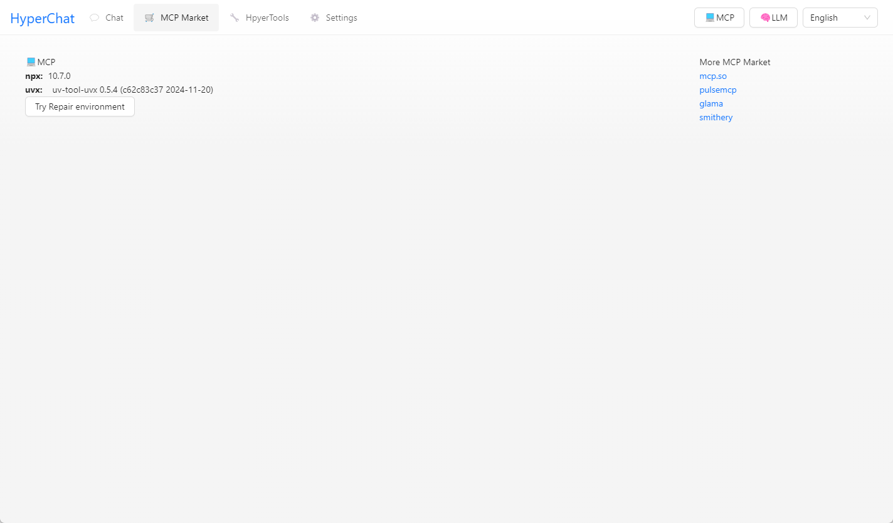

[中文](README.zh.md) | [English](README.md)


## Features

Supports Chat with the [MCP](https://modelcontextprotocol.io/introduction) protocol, using a protocol similar to OpenAI, compatible with the `Claude Desktop` configuration. Supports `Client` hot reloading, restarting, and disabling.

### MCP:

[](https://github.com/BigSweetPotatoStudio/HyperChat/actions/workflows/build.yml)

- [x] 🪟Windows+🍏MacOS
- [x] Supports `nvm`, see below
- [x] Resources support
- [x] Partial support for Prompts
- [x] Tools support
- [x] Supports English and Chinese
- [x] Added built-in MCP client `hypertools`, `fetch` + `search`
- [x] gpts- supports selection of allowed MCP clients and tools

### TODO:

- [ ] Easier to use
- [ ] Permission pop-up, whether to allow
- [ ] Support for scheduled tasks

### LLM

| LLM      | Usability | Remarks                     |
| -------- | --------- | --------------------------- |
| claude   | ⭐⭐⭐⭐⭐    | No explanation              |
| openai   | ⭐⭐⭐⭐🌙   | Also perfectly supports multi-step function calls (gpt-4o-mini does too) |
| doubao   | ⭐⭐⭐      | Feels okay to use           |
| deepseek | ⭐⭐       | Multi-step function calls have issues |

## Usage

* 1. You need to configure your OpenAI-style APIKEY
* 2. Ensure that uvx or npx is installed on your system.

### [uvx](https://github.com/astral-sh/uv)

```
brew install uv
```
### [npx & nodejs](https://nodejs.org/en)

```
brew install node 
```

## Development

```
cd electron && npm install
cd web && npm install
npm install
npm run dev
```

## Note

* MacOS encountered damaged or permission issues, `sudo xattr -d com.apple.quarantine /Applications/HyperChat.app`
* MacOS `nvm` users manually input PATH `echo $PATH`, it seems that Windows version `nvm` can be used directly



## Telegram

[HyperChat User Communication](https://t.me/dadigua001)


