[中文](README.zh.md) | [English](README.md)


## Introduction

HyperChat is an open Chat client that can use APIs from various LLMs, fully supports MCP, and provides the best Chat experience. It also implements productivity MAX tools based on native Agents.

[](https://github.com/BigSweetPotatoStudio/HyperChat/actions/workflows/build.yml)

[](https://npm-stat.com/charts.html?package=@dadigua/hyper-chat)


* Supports OpenAI-style LLMs, `OpenAI`, `Claude(OpenRouter)`, `Qwen`, `Deepseek`, `GLM`, `Ollama`.
* Built-in MCP plugin market, user-friendly MCP installation configuration, one-click installation, welcome to submit [HyperChatMCP](https://github.com/BigSweetPotatoStudio/HyperChatMCP).
* Also supports manual installation of third-party MCPs, just fill in `command`, `args`, `env`.

## DEMO

* [HyperChat](https://hyperchat.dadigua.men/123456/) on Docker

## Features:

- [x] **🪟Windows** + **🍏MacOS** + **Linux**
- [x] Command line run, `npx -y @dadigua/hyper-chat`, default port 16100, password 123456, Web access http://localhost:16100/123456/
- [x] Docker 
    * Command line version `docker pull dadigua/hyper-chat-mini:1.2.8`
    * Ubuntu desktop + Chrome + BrowserUse version (**coming soon**)
- [x] `MCP` extension market + third-party MCP support
- [x] Supports free creation, design of `Agent`, can preset prompts, choose MCP functions
- [x] Supports dark mode🌙
- [x] Supports Resources, Prompts, Tools
- [x] Supports English and Chinese
- [x] Supports `Artifacts`, `SVG`, `HTML` rendering, JS error capture, supports opening Chrome console
- [x] Agent display optimization, supports search, drag-and-drop sorting
- [x] Supports `KaTeX`, displays mathematical formulas, code rendering increases highlighting and quick copy
- [x] `WebDAV` synchronization
- [x] Added `RAG`, based on MCP knowledge base
- [x] Introduced the concept of ChatSpace, supports simultaneous chatting with multiple dialogues
- [x] Supports Agent Call Agent through HyperAgent’s MCP
- [x] Added scheduled tasks, specifying Agents to complete tasks at set times, and viewing task completion status.

### TODO:

- [ ] Future updates will include a docker version with a built-in Linux desktop, built-in Chrome configuration, unified environment for easier handling, and web interface control. It can be used on any device, including mobile phones. 🤣
- [ ] Permission pop-up, whether to allow
- [ ] Implement LLM writing MCP for itself

### LLM

| LLM      | Usability  | Remarks                      |
| -------- | -------- | -------------------------- |
| claude   | ⭐⭐⭐⭐⭐    | No explanation             |
| openai   | ⭐⭐⭐⭐⭐   | Also perfectly supports multi-step function calls (gpt-4o-mini can also) |
| gemini flash 2.0   | ⭐⭐⭐⭐🌙   | Very useful               |
| qwen       | ⭐⭐⭐⭐🌙   | Very useful               |
| doubao       | ⭐⭐⭐🌙🌙   | Feels okay to use         |
| deepseek | ⭐⭐⭐🌙🌙   | Multi-step function calls may have issues |

## Usage

* 1. Configure APIKEY, ensure your LLM service is compatible with OpenAI style.
* 2. Make sure your system has `uv + nodejs` installed.

### [uvx & uv](https://github.com/astral-sh/uv)

Install using the command line, or check the official GitHub tutorial [uv](https://github.com/astral-sh/uv)

```
# MacOS
brew install uv
# Windows
winget install --id=astral-sh.uv  -e
```
### [npx & nodejs](https://nodejs.org/en)

Install using the command line, or go to the official site to download, official site [nodejs](https://nodejs.org/en)
```
# MacOS
brew install node
# Windows
winget install OpenJS.NodeJS.LTS
```

## Development

```
cd electron && npm install
cd web && pnpm install
npm install
npm run dev
```


## Notes

* MacOS may encounter damage or permission issues, `sudo xattr -d com.apple.quarantine /Applications/HyperChat.app`
* MacOS `nvm` users manually input PATH `echo $PATH`, Windows version `nvm` seems to work directly

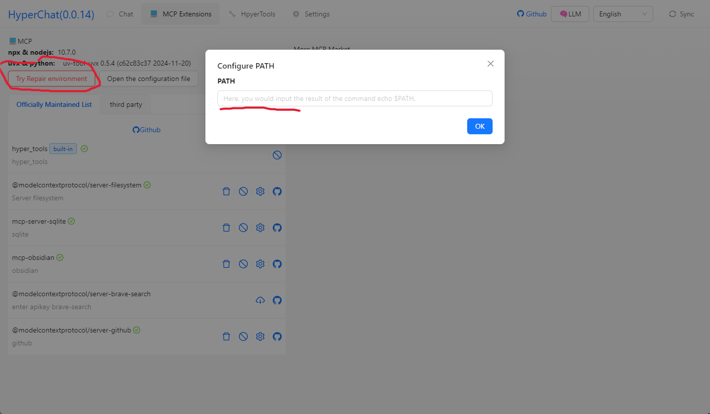


## Telegram

[HyperChat User Communication](https://t.me/dadigua001)

#### Call shell mcp
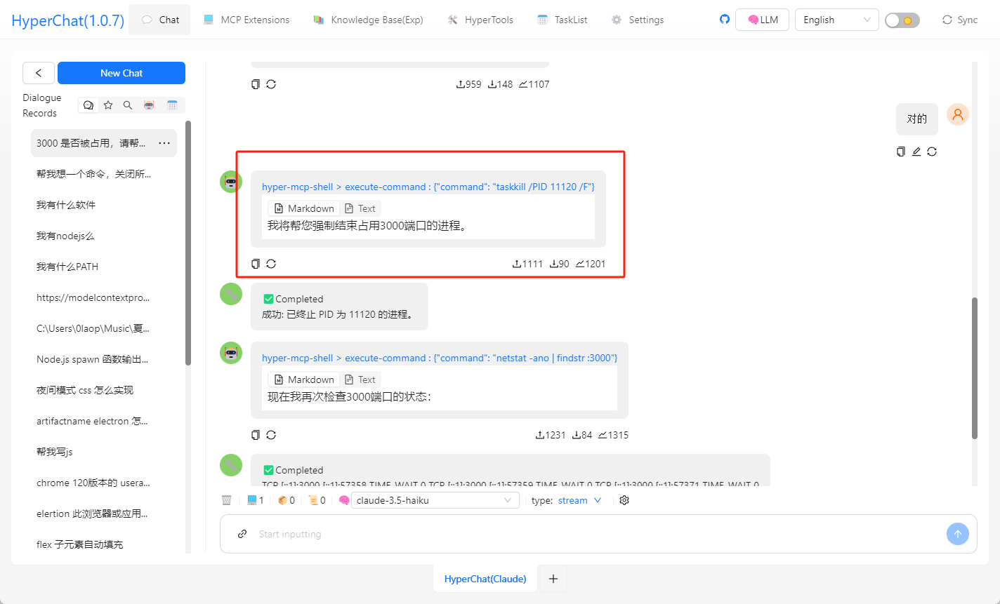

#### Call terminal mcp, ssh + can execute commands
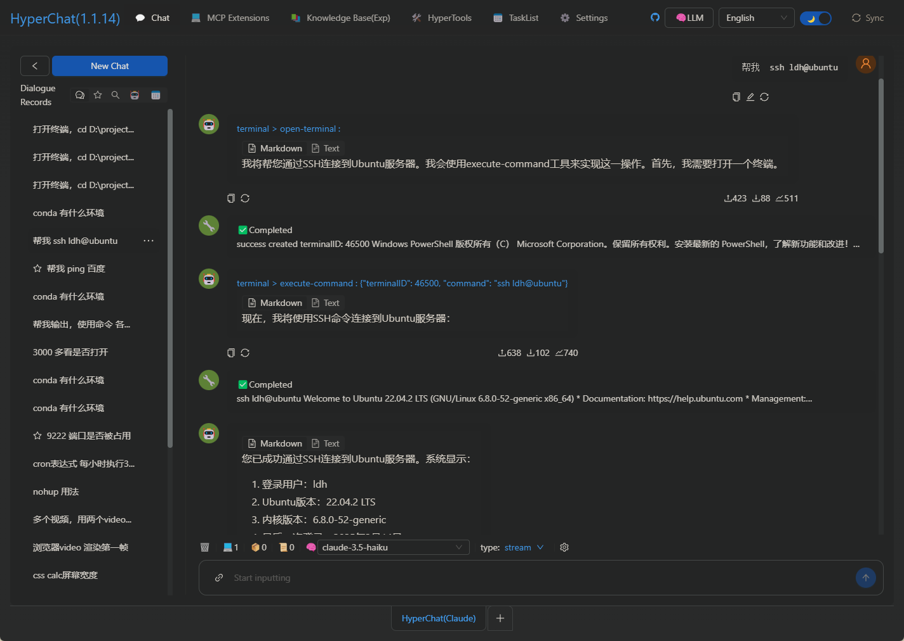

#### One-click to write a webpage and publish to (cloudflare)
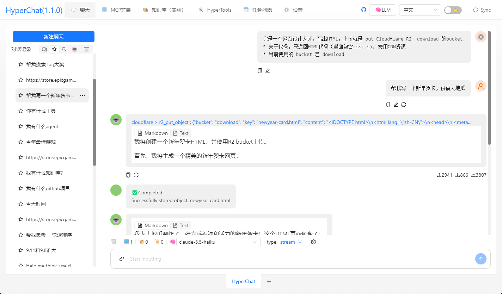

#### Call Google Search, ask it what TGA Game of the Year is
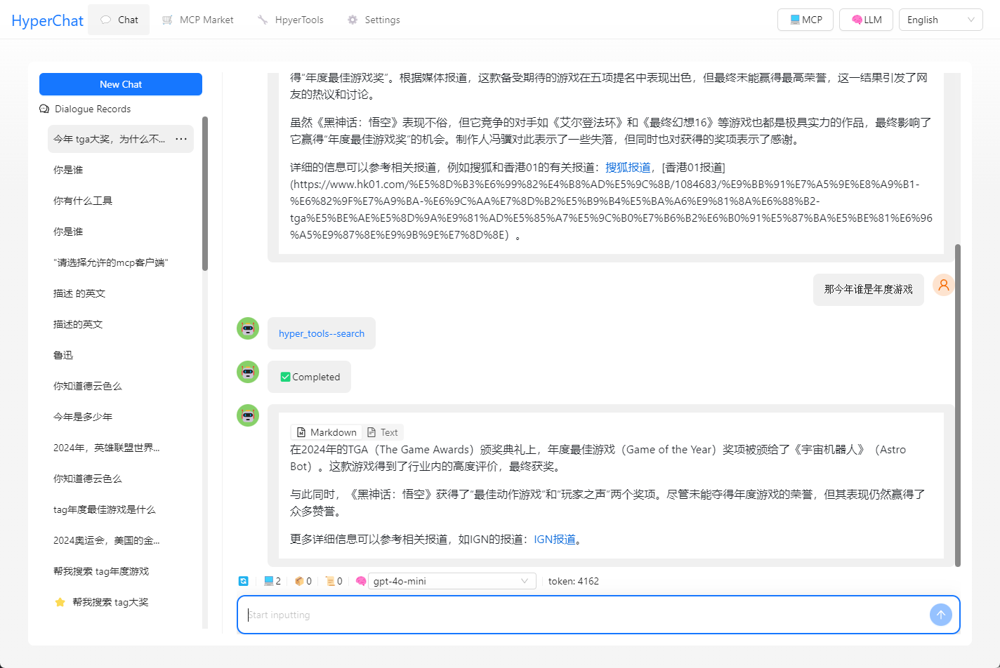

#### Organize Zhihu hot searches
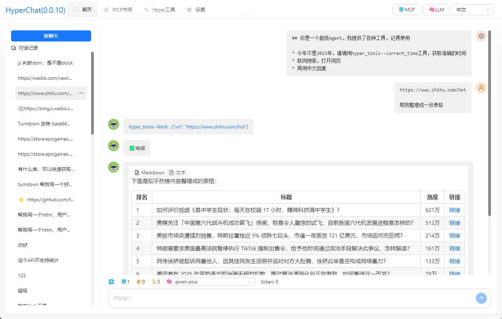

#### Help you open web pages, analyze results, and write to files
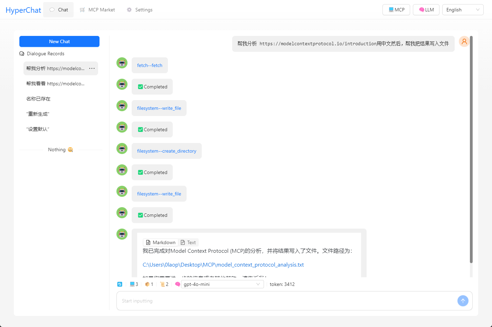

#### Open Baidu and take screenshots
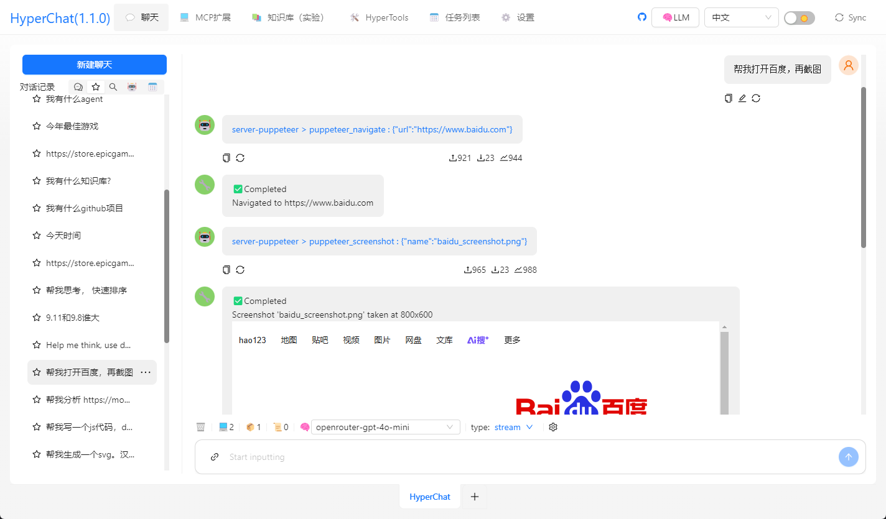


#### Scheduled task list


#### MCP market (experimental)


#### Install MCP interface from the market (experimental)


#### Install MCP from third-party (supports any MCP)


#### Install MCP interface from third-party


#### MCP list (can be dynamically selected)
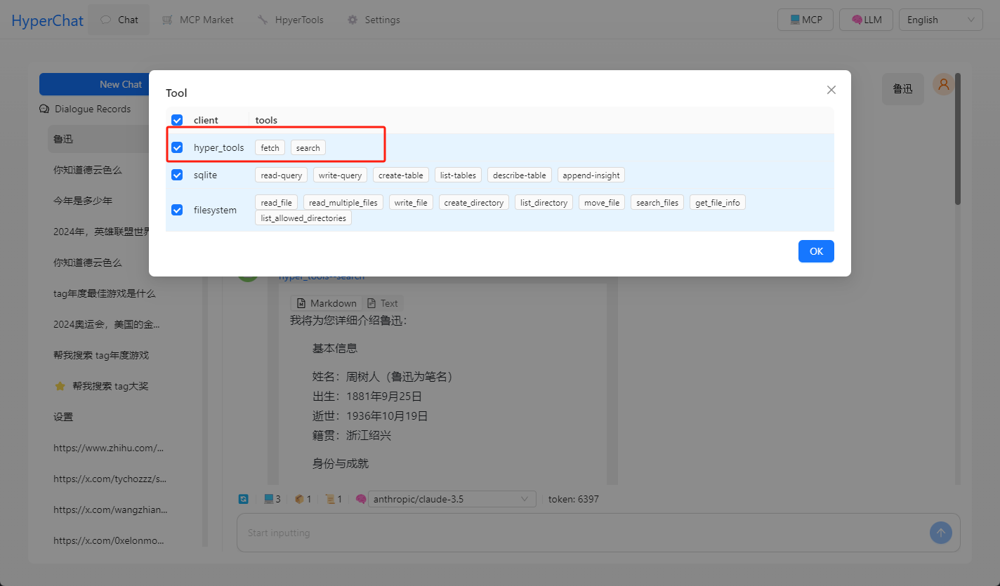

#### Render HTML, support `Artifacts`, `SVG`, `HTML` rendering,


#### Interface 1
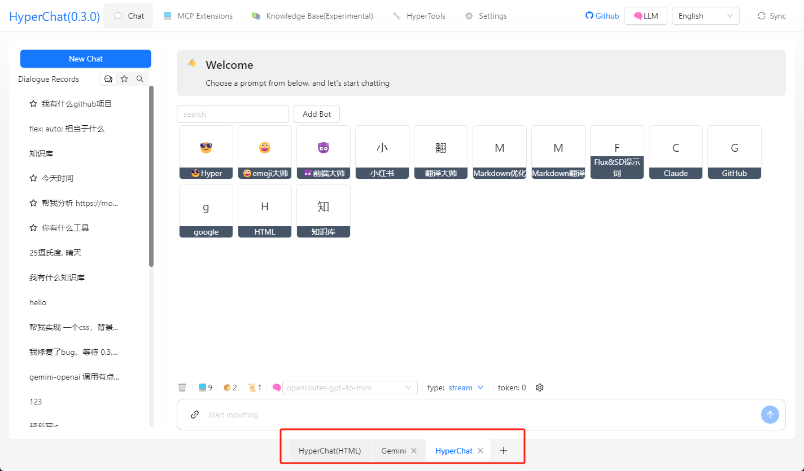

#### Interface 2


#### Interface 3, test model capabilities


#### Knowledge base
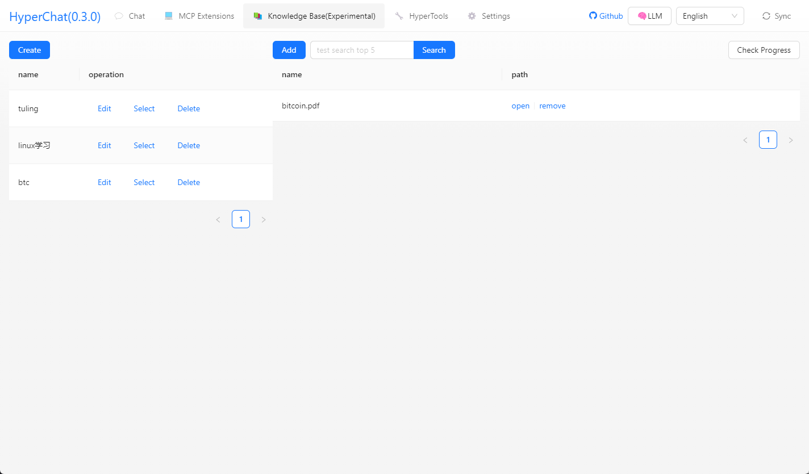

## Disclaimer

* This project is for learning and exchange purposes only. If you use this project for any actions, such as crawling behaviors, it has nothing to do with the developers of this project.