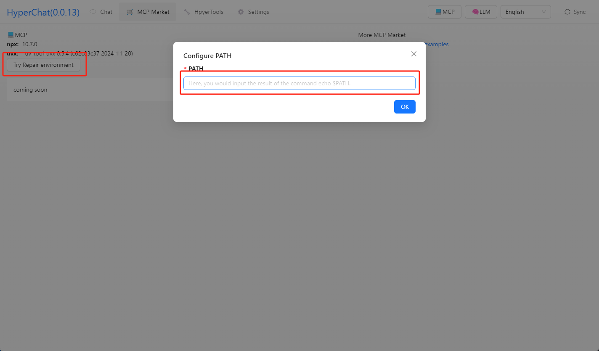
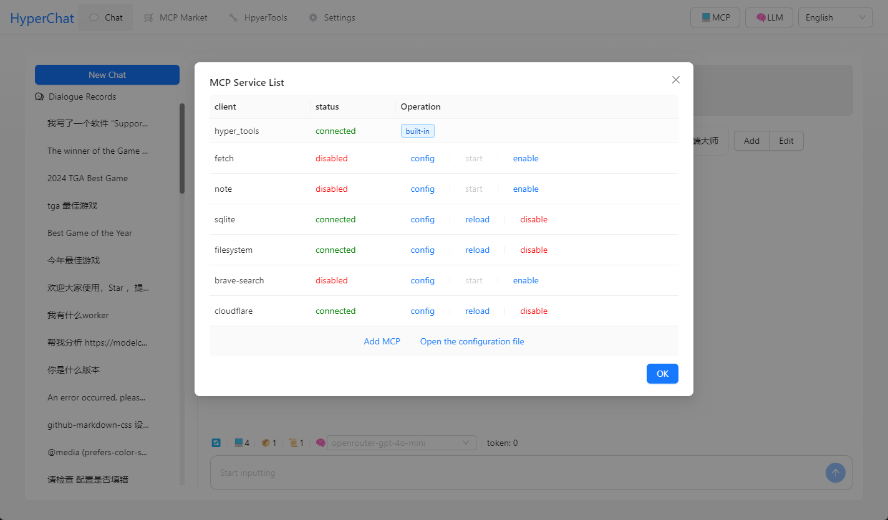
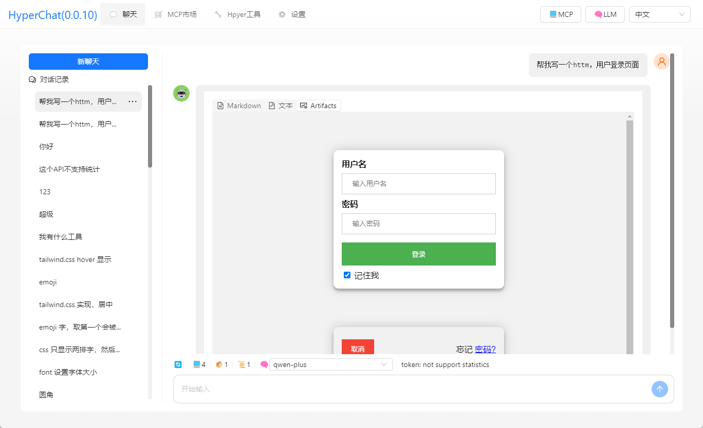

[中文](README.zh.md) | [English](README.md)


## Features

HyperChat is an open Chat client that can use various LLM APIs to achieve the best Chat experience and implement productivity tools through the MCP protocol.

Supports Chat with the [MCP](https://modelcontextprotocol.io/introduction) protocol, using a protocol similar to OpenAI, compatible with `Claude Desktop` configuration files. Supports `Client` hot reload, restart, and disable.

### MCP:

[](https://github.com/BigSweetPotatoStudio/HyperChat/actions/workflows/build.yml)

- [x] 🪟Windows + 🍏MacOS
- [x] Supports `nvm`, see below
- [x] Resources support
- [x] Partial support for Prompts
- [x] Tools support
- [x] Supports English and Chinese
- [x] Added built-in MCP client `hypertools`, `fetch` + `search`
- [x] Supports `Bot`, allows preset prompts and permitted MCP services
- [x] Supports `Artifacts`, `HTML`, `SVG` rendering
- [x] Bot display optimization, supports search and drag-and-drop sorting
- [x] Supports `KaTeX`, displays mathematical formulas
- [x] `WebDAV` sync

### TODO:

- [ ] Permissions pop-up, whether to allow
- [ ] Supports scheduled tasks
- [ ] Supports Projects + RAG
- [ ] Implement self-writing Tools using LLM
- [ ] Local `shell` + `nodejs` + `js on web` runtime environment

### LLM

| LLM      | Usability   | Notes                        |
| -------- | ------ | ---------------------------- |
| claude   | ⭐⭐⭐⭐⭐  | No explanation               |
| openai   | ⭐⭐⭐⭐🌙 | Can also perfectly support multi-step function calls (gpt-4o-mini can also) |
| qwen     | ⭐⭐⭐⭐🌙 | Very easy to use, feels better than OpenAI |
| doubao   | ⭐⭐⭐    | Feels okay to use           |
| deepseek | ⭐⭐      | Multi-step function calls may have issues |

## Usage

* 1. Configure APIKEY, ensure your LLM service is compatible with OpenAI style.
* 2. Ensure that `uv + nodejs` are installed on your system.

### [uvx & uv](https://github.com/astral-sh/uv)

Install using the command line or check the official GitHub tutorial [uv](https://github.com/astral-sh/uv)

```
# MacOS
brew install uv
# windows
winget install --id=astral-sh.uv  -e
```
### [npx & nodejs](https://nodejs.org/en)

Install using the command line or download from the official website [nodejs](https://nodejs.org/en)
```
# MacOS
brew install node
# windows
winget install OpenJS.NodeJS.LTS
```

## Development

```
cd electron && npm install
cd web && npm install
npm install
npm run dev
```

## Notes

* MacOS may encounter issues with being damaged or permissions; use `sudo xattr -d com.apple.quarantine /Applications/HyperChat.app`
* MacOS `nvm` users manually input PATH `echo $PATH`; the Windows version of `nvm` seems to be usable directly



## Telegram

[HyperChat User Discussion](https://t.me/dadigua001)








