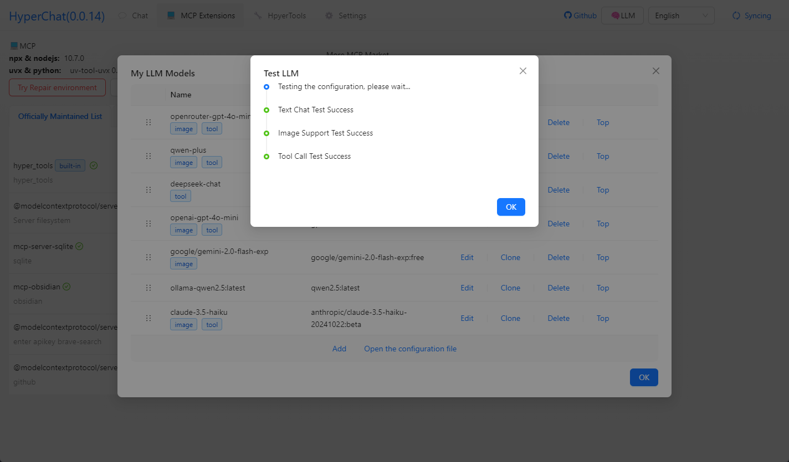
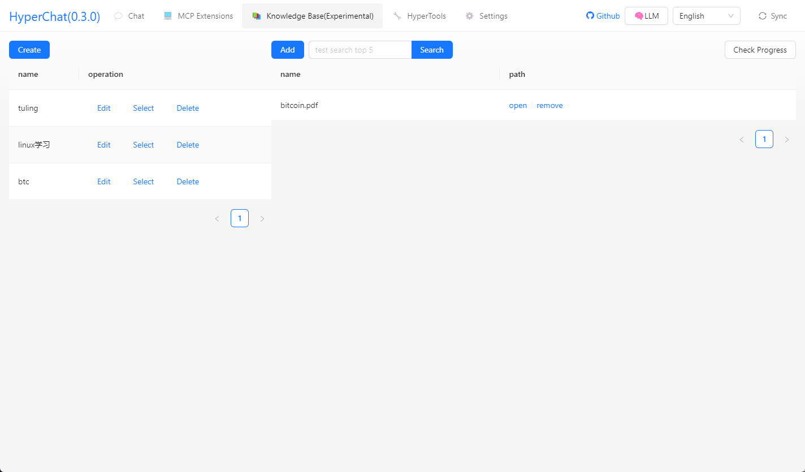

[中文](README.zh.md) | [English](README.md)


## Introduction

HyperChat is an open-source Chat client that supports MCP and can use various LLM APIs to provide the best Chat experience, as well as implement productivity tools.

[](https://github.com/BigSweetPotatoStudio/HyperChat/actions/workflows/build.yml)
[](https://www.npmjs.com/package/@dadigua/hyper-chat)
[](https://npm-stat.com/charts.html?package=@dadigua/hyper-chat)

* Supports OpenAI-style LLMs: `OpenAI`, `Claude`, `Claude(OpenAI)`, `Qwen`, `Deepseek`, `GLM`, `Ollama`, `xAI`, `Gemini`.
* Fully supports MCP.

## DEMO

* [HyperChat](https://hyperchat.dadigua.men/123456/) on Node.js
* [Docker](https://htmivlknrjln.ap-northeast-1.clawcloudrun.com/123456/#/Chat) on ClawCloud

## Features: 

- [x] **🪟Windows** + **🍏MacOS** + **Linux**
- [x] Command-line operation: `npx -y @dadigua/hyper-chat`, default port 16100, password 123456, Web access http://localhost:16100/123456/
- [x] Docker 
    * Command-line version `docker pull dadigua/hyperchat-mini:latest`
    * Ubuntu desktop + Chrome + BrowserUse version (**coming soon**)
- [x] `MCP GateWay` gateway, combining multiple MCP tools into one MCP, supporting `see`, `http`
- [x] `WebDAV` supports incremental synchronization, the fastest synchronization through hash.
- [x] `HyperPrompt` prompt syntax, supporting variables (text + js code variables), basic syntax checking + hover real-time preview.
- [x] `MCP` extension
- [x] Supports dark mode🌙
- [x] Supports Resources, Prompts, Tools
- [x] Supports English and Chinese
- [x] Supports `Artifacts`, `SVG`, `HTML`, `Mermaid` rendering
- [x] Supports defining Agents, allowing preset prompts and selection of permitted MCPs
- [x] Supports scheduled tasks, assigning Agents to complete tasks on a schedule, and checking task completion status.
- [x] Supports `KaTeX`, displaying mathematical formulas, code rendering with highlighting and quick copy
- [x] Add `RAG`, based on MCP knowledge base
- [x] Introduce ChatSpace concept, supporting multi-dialog simultaneous chatting
- [x] Supports chat model selection and comparison

### TODO:

- Implement a multi-Agent interaction system.

### LLM

| LLM      | Usability    | Notes                         |
| -------- | ------ | ---------------------------- |
| claude   | ⭐⭐⭐⭐⭐⭐  | No explanation                |
| openai   | ⭐⭐⭐⭐⭐ | Can also perfectly support multi-step function calls (gpt-4o-mini can also) |
| gemini flash 2.5   | ⭐⭐⭐⭐⭐ | Very user-friendly           |
| qwen       | ⭐⭐⭐⭐    | Quite user-friendly          |
| doubao       | ⭐⭐⭐    | Feels okay to use            |
| deepseek | ⭐⭐⭐⭐      | Recently improved           |

## Usage

* 1. Configure APIKEY, ensure your LLM service is compatible with OpenAI style.
* 2. Ensure that `uv + nodejs` and other dependencies are installed in your system.

### [uvx & uv](https://github.com/astral-sh/uv)

Install via command line, or check the official Github tutorial [uv](https://github.com/astral-sh/uv)

```
# MacOS
brew install uv
# Windows
winget install --id=astral-sh.uv  -e
```
### [npx & nodejs](https://nodejs.org/en)

Install via command line, or download from the official website, [nodejs](https://nodejs.org/en)
```
# MacOS
brew install node
# Windows
winget install OpenJS.NodeJS.LTS
```

## Development

```
cd electron && npm install
cd web && npm install
npm install
npm run dev
```

## HyperChat User Communication

* [Telegram](https://t.me/dadigua001)
* [QQ Group](https://qm.qq.com/cgi-bin/qm/qr?k=KrNWdu5sp7H3ves3ZPSd7ppKjQiPrAvZ&jump_from=webapi&authKey=xnW+Lcgk5KLh5NPh3lU0ddz9CFDbXgvjEy35wsYipUrCsqXFcqlvM5Yorh6jkGim)

#### MCP GateWay gateway, combining multiple MCP tools into one MCP, exposed for external AI tool use.


#### Super input, supports variables (text + js code variables), basic syntax checking + hover real-time preview


#### Chat supports model selection comparison


#### Supports clicking on tool names for direct debugging


#### MCP calling tool prompts + dynamically modifying LLM call tool parameters


#### Supports @ quick input + calling Agent


#### Supports rendering of `Artifacts`, `SVG`, `HTML`, `Mermaid`,


#### Supports selecting MCP + selecting certain tools


#### You can access it anywhere+on any device via Web and set a password


#### Calling terminal MCP to automatically analyze asar files + help me extract them


#### Calling terminal, compiling and upgrading nginx


#### Gaode Map MCP


#### One-click web page creation and publishing to (cloudflare)


#### Calling Google search to ask what TGA Game of the Year is


#### What are the time-limited free games, please visit the website, call the tool


#### Helps you open web pages, analyze results, and write to files


#### Through web tools + command line tools, open Github README for learning + GIT clone + set up dev environment


#### Multi-chat Workspace + Night mode


#### Scheduled task list + timed message sending to Agent to complete tasks


#### Installing MCP from third parties (supports any MCP) 


#### h5 interface


#### Testing model capabilities


#### Knowledge base


## Disclaimer

* This project is for learning and communication purposes only. If you use this project for any operations, such as web scraping, it is unrelated to the developers of this project.