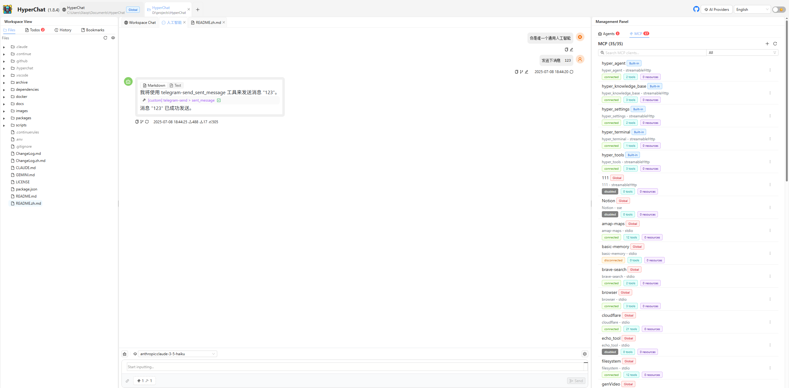

# HyperChat 中文文档

# HyperChat

> 🌟 **下一代 AI 工作空间** - AI as Code 的开创性实践，配置驱动的智能协作平台

HyperChat 2.0 是一个革命性的多平台 AI 工作空间，首创**「AI as Code」**理念，以**工作区（Workspace）**为核心，**配置文件**为驱动，完整支持 **MCP（模型上下文协议）**生态。让 AI 能力像基础设施一样**可版本控制、可复制、可共享**，打造真正智能的开发和工作环境。

[](https://github.com/BigSweetPotatoStudio/HyperChat/actions/workflows/build.yml)
[](https://www.npmjs.com/package/@dadigua/hyper-chat)
[](https://npm-stat.com/charts.html?package=@dadigua/hyper-chat)

## 🎯 项目愿景

**[HyperChat 1.0](./archive/README.1.md)** 是一个完全手工编写的项目，正在迁移到2.0。

**HyperChat 2.0** 大家一起 **Vibe Coding**，欢迎使用 Claude Code 和 GitHub Copilot 等 AI 工具一起开发。

## 🎯 核心理念

### 🗂️ AI as Code：配置驱动的智能革命
HyperChat 2.0 首创**「AI as Code」**理念，将 AI 能力彻底配置化：

- **完全配置化**：所有 AI 能力通过 YAML/JSON 配置文件定义
- **版本控制友好**：AI 配置可以 git 管理，支持分支、合并、回滚
- **团队协作标准化**：共享 Agent 配置，复制最佳实践
- **项目模板化**：不同项目类型有专属的 AI 环境模板
- **声明式管理**：修改配置文件即可改变 AI 行为，无需编程

### 🔌 工作区驱动的智能协作
HyperChat 2.0 以**工作区（Workspace）**为核心，将 AI 能力与您的项目紧密结合：

- **项目工作区**：每个项目都有独立的 `.hyperchat/` 配置目录
- **全局工作区**：系统级配置，可跨项目共享
- **工作区隔离**：Agent、MCP 服务、聊天记录按工作区独立管理
- **无缝切换**：多工作区标签页，一键切换不同项目环境

### 🛠️ MCP 生态深度集成
作为 MCP 协议的完整实现，HyperChat 打造了强大的工具生态：

- **丰富的内置 MCP 服务**：文件系统、终端、设置管理、知识库等
- **动态工具调用**：实时加载和管理 MCP 工具
- **工作区级配置**：每个工作区可配置不同的 MCP 服务
- **调试友好**：可视化工具调用过程，支持参数调试

## ⌨️ 强大的 CLI 功能

HyperChat 2.0 提供了类似 Claude Code 的强大命令行体验，让您在终端中直接享受完整的 AI 能力：

### 🔥 核心 CLI 特性
- **即时 AI 对话**：`hyperchat "你的问题"` - 无需启动界面，直接获得 AI 响应
- **专业 Agent 管理**：创建、配置和管理专业化 AI 代理
- **智能工作区系统**：自动检测项目环境，提供上下文相关的 AI 支持
- **定时任务自动化**：让 AI 代理按计划完成重复性工作
- **灵活交互模式**：支持一次性命令和持续交互式对话
- **完整服务管理**：一键启动 Web 服务或后台核心服务
- **跨平台兼容**：在 Windows、macOS 和 Linux 上提供一致体验

### 💡 CLI 使用场景
- **开发者日常**：代码审查、文档生成、bug 分析
- **运维自动化**：系统监控、日志分析、报告生成  
- **内容创作**：文章写作、翻译校对、创意brainstorm
- **学习研究**：知识问答、概念解释、技术调研
- **团队协作**：标准化的 AI 工作流，可复制的专业经验

## ✨ 核心特性

### 🏢 多平台渐进支持
- ⌨️ **命令行界面** ✅：首要平台，类似 Claude Code 的完整终端体验，功能最全面
- 🌐 **Web 应用** 🚧：浏览器访问，支持 H5 移动端，基于 CLI 核心构建
- 💻 **Electron 桌面** 🔄：原生应用体验，集成 Web 界面，开发中
- 🔧 **VSCode 插件** 📋：IDE 集成，通过 WebView 访问，规划中

### 📄 一切皆配置
- **透明可控**：所有 AI 行为都有对应配置文件，完全可见可控
- **版本管理**：AI 配置支持 Git 版本控制，变更历史可追溯
- **团队共享**：Agent 配置和工作流模板可标准化并在团队中复用
- **模板生态**：不同技术栈有专属的 AI 环境配置模板
- **配置即文档**：YAML 配置文件本身就是最好的文档和规范
- **环境变量支持**：5层优先级的环境变量系统，支持从环境变量读取 API 密钥和配置
- **灵活部署**：支持 Docker、CI/CD 环境的无界面配置管理

### 🎨 现代化界面
- **标签页工作区**：直观的多工作区管理
- **智能渲染**：Artifacts、SVG、HTML、Mermaid、数学公式支持
- **暗黑模式**：护眼的深色主题
- **多语言支持**：中英文无缝切换

## 🚀 快速体验

### ⌨️ 命令行快速启动
```bash
# 全局安装
npm install -g @dadigua/hyperchat

# 或直接运行
npx -y @dadigua/hyperchat
```

**快速配置环境变量**：
```bash
# 基础配置 - 设置默认 AI 模型
export HyperChat_API_KEY=your-api-key           # API 密钥
export HyperChat_API_URL=your-api-url           # API 端点 URL
export HyperChat_AI_Provider=openai             # AI 提供商 (openai/claude/gemini/kimi/qwen等)
export HyperChat_AI_Model=gpt-4o                # 默认模型名称

# 然后直接使用
hyperchat "你好，世界！"                        # 使用配置的默认模型
```

#### CLI 使用示例
```bash
# 启动 Web 界面
hyperchat serve                        # 访问: http://localhost:16100

# 运行核心服务（后台）
hyperchat run                          # 不包含 Web 界面运行

# 快速 AI 聊天
hyperchat "你好，今天怎么样？"           # 直接与默认模型聊天
hyperchat chat "写一个 Python 脚本"     # 聊天命令
hyperchat chat                         # 交互式聊天模式

# Agent 管理和聊天
hyperchat agent list                   # 列出所有代理
hyperchat agent create mybot           # 创建新代理
hyperchat agent delete mybot           # 删除代理
hyperchat agent mybot "你好"           # 与特定代理快速聊天
hyperchat agent mybot chat             # 与代理交互式聊天

# 工作区管理
hyperchat workspace create             # 在当前目录创建工作区

# 任务管理（定时自动化）
hyperchat task list                    # 列出所有任务
hyperchat task create "daily-report" --description "生成日报" --agent mybot --cron "0 9 * * *"
hyperchat task trigger "daily-report"  # 手动触发任务
hyperchat task stats                   # 显示任务统计

# 全局选项
hyperchat chat --workspace /path/to/project  # 使用特定工作区
hyperchat --verbose chat "你好"             # 详细日志
hyperchat --help                             # 显示帮助

# 环境变量使用
export HYPERCHAT_WEB_PASSWORD=mypass         # 设置 Web 密码
export HYPERCHAT_LANGUAGE=en                 # 设置界面语言为英文
hyperchat serve --port 8080                  # CLI 参数覆盖环境变量
```

### 在线 Demo
- [HyperChat](https://hyperchat.dadigua.men/123456/) - Node.js 版本
- [Docker Demo](https://htmivlknrjln.ap-northeast-1.clawcloudrun.com/123456/#/Chat) - ClawCloud 部署

### Docker 部署
```bash
docker pull dadigua/hyperchat-mini:latest
```

## 📦 环境要求

确保您的系统已安装：
- Node.js
- uv (推荐用于 Python 环境管理)

### 🔧 环境变量配置

HyperChat 2.0 实现了强大的**5层优先级环境变量系统**，让配置管理更加灵活：

**优先级顺序**（从低到高）：
1. **默认值** - 代码中的内置默认配置
2. **process.env** - 系统环境变量
3. **全局 .env** - `~/Documents/HyperChat/.env`
4. **工作区 .env** - 项目目录下的 `.env` 文件
5. **CLI 参数** - 命令行传入的参数（最高优先级）

**支持的核心环境变量**：
```bash
# 快速配置 - 默认 AI 模型
HyperChat_API_KEY=your-api-key              # 默认 API 密钥
HyperChat_API_URL=your-api-url              # 默认 API 端点
HyperChat_AI_Provider=openai                # 默认 AI 提供商
HyperChat_AI_Model=gpt-4o                   # 默认模型名称


# 服务配置
HYPERCHAT_WEB_PASSWORD=your-web-password    # Web 界面访问密码
HYPERCHAT_PORT=16100                        # Web 服务端口
HYPERCHAT_HOST=localhost                    # 服务绑定地址

# 界面配置
HYPERCHAT_LANGUAGE=zh                       # 界面语言 (zh/en)
HYPERCHAT_LOG_LEVEL=info                    # 日志级别

# 自定义 API 端点
HYPERCHAT_OPENAI_BASE_URL=https://api.openai.com/v1
HYPERCHAT_CLAUDE_BASE_URL=https://api.anthropic.com
```

**使用示例**：
```bash
# 方式1：快速配置默认模型
export HyperChat_API_KEY=sk-1234567890
export HyperChat_AI_Provider=openai
export HyperChat_AI_Model=gpt-4o
hyperchat "你好"                            # 直接使用默认配置

# 方式2：Web 服务配置
export HYPERCHAT_WEB_PASSWORD=mypassword
hyperchat serve

# 方式3：项目 .env 文件
echo "HyperChat_API_KEY=your-key" > .env
echo "HyperChat_AI_Provider=claude" >> .env
hyperchat chat

# 方式4：CLI 参数（最高优先级）
hyperchat serve --password=clipass

# 方式5：全局配置文件
echo "HyperChat_API_KEY=global-key" > ~/Documents/HyperChat/.env
echo "HyperChat_AI_Provider=gemini" >> ~/Documents/HyperChat/.env
```

### 安装 uv
```bash
# macOS
brew install uv

# Windows
winget install --id=astral-sh.uv -e
```

### 安装 Node.js
```bash
# macOS
brew install node

# Windows
winget install OpenJS.NodeJS.LTS
```

### ⚠️ Windows 重要要求

**Windows 用户必须使用 Node.js 版本 20.19.1**，这是由于原生模块编译要求（特别是 node-pty）。

```bash
# 在 Windows 上安装特定 Node.js 版本
nvm install 20.19.1
nvm use 20.19.1

# 或从 Node.js 官网直接下载
# https://nodejs.org/dist/v20.19.1/
```

#### Windows 原生依赖

HyperChat 依赖 `node-pty` 来实现终端功能，这需要：

1. **Visual Studio Build Tools**：用于 C++ 编译
2. **Python**：用于 node-gyp
3. **Windows SDK**：用于原生模块构建

**安装建议：**
- 阅读官方 [node-pty 安装指南](https://github.com/microsoft/node-pty#dependencies) 了解详细的 Windows 设置
- 建议使用 **Windows Subsystem for Linux (WSL)** 来简化开发环境设置
- 从 [Microsoft Visual Studio](https://visualstudio.microsoft.com/build-tools/) 安装 Visual Studio Build Tools

**如果遇到编译错误：**
```bash
# 安装 windows-build-tools（旧系统可能需要）
npm install --global windows-build-tools

# 或使用 chocolatey
choco install visualstudio2019buildtools
```

详细故障排除请参考：
- [node-pty GitHub 仓库](https://github.com/microsoft/node-pty)
- [Node.js 原生插件文档](https://nodejs.org/api/addons.html)

## 🛠️ 技术架构

### 📂 项目结构
```
HyperChat/
├── packages/
│   ├── shared/            # 共享代码和类型定义
│   ├── core/              # Node.js 核心服务 + CLI（主要平台）
│   │   ├── src/cli/       # 命令行界面（首要平台，功能最完整）
│   │   ├── src/workspace/ # 工作区管理系统
│   │   ├── src/mcp/       # MCP 服务实现
│   │   └── src/commands/  # API 命令层
│   ├── web/               # React Web 前端（基于 CLI 核心）
│   └── electron/          # Electron 桌面应用（开发中）
└── docs/                  # 完整文档
```

### 🏗️ AI as Code 架构
```
项目目录/
├── .hyperchat/           # AI 能力配置目录（可版本控制）
│   ├── workspace.json    # 工作区配置
│   ├── mcp.json         # MCP 服务配置（Tools as Code）
│   ├── ai_models.json   # AI 模型配置
│   ├── tasks/           # 工作流配置（Workflow as Code）
│   │   ├── daily-report.yaml  # 自动化任务定义
│   │   └── code-review.yaml   # 代码审查流程
│   └── agents/          # AI 智能体配置（AI as Code）
│       ├── frontend-expert/
│       │   ├── agent.yaml      # Agent 能力定义
│       │   ├── memory.md       # 持久化记忆
│       │   └── chatlogs/       # 对话历史
│       ├── backend-optimizer/
│       └── security-scanner/
├── .git/                # 代码版本控制
├── .gitignore
└── README.md

# 全局模板库
~/Documents/HyperChat/
├── .hyperchat/          # 全局配置
└── templates/           # 项目模板
    ├── react-project/   # React 项目 AI 环境
    ├── python-ml/       # Python ML 项目 AI 环境
    └── golang-api/      # Go API 项目 AI 环境
```

### 🔄 配置驱动架构
- **环境变量管理**：5层优先级的环境变量系统，支持灵活的配置叠加
- **配置解析层**：自动解析 YAML/JSON 配置，实时生效
- **统一命令层**：`packages/core/src/command.mts` 处理前后端通信
- **AI 服务层**：`packages/shared/src/ai.mts` 统一 AI 模型调用，支持从环境变量获取 API 密钥
- **工作区管理**：`packages/core/src/workspace/` 提供配置驱动的工作区管理
- **MCP 集成**：`packages/core/src/mcp/` 实现完整的 MCP 协议支持
- **实时通信**：WebSocket 支持实时消息推送和配置热重载

## 🌟 AI as Code 的革命性优势

### 🔄 像管理代码一样管理 AI
```bash
# AI 配置也可以版本控制
git add .hyperchat/agents/code-reviewer/
git commit -m "添加 TypeScript 专用代码审查 Agent"
git push origin feature/new-agent

# 分享团队 AI 最佳实践
git clone https://github.com/team/ai-templates.git
cp -r ai-templates/react-expert/.hyperchat ./

# 回滚 AI 配置
git checkout HEAD~1 -- .hyperchat/agents/
```

### 📋 配置即文档
```yaml
# .hyperchat/agents/frontend-expert/agent.yaml
name: "前端架构专家"
description: "专注于 React、TypeScript、性能优化的 AI 助手"
modelKey: "claude-3-5-sonnet"
isConfirmCallTool: false
allowMCPs: ["filesystem", "terminal", "knowledge-base"]
prompt: |
  你是一位资深的前端架构师，专精于：
  1. React 18+ 最佳实践和性能优化
  2. TypeScript 类型系统设计
  3. 现代前端工程化工具链
  4. 响应式设计和移动端适配
  
  工作原则：
  - 优先考虑性能和可维护性
  - 遵循团队编码规范
  - 提供可执行的具体建议
tags: ["frontend", "react", "typescript", "performance"]
```

### 🚀 项目模板标准化
```bash
# 快速初始化 React 项目的 AI 环境
hyperchat workspace create
cp -r ~/.hyperchat/templates/react-enterprise/.hyperchat ./

# 立即获得：
# ✅ 前端开发专家 Agent
# ✅ 代码审查自动化流程
# ✅ 性能监控任务
# ✅ 文档生成工作流
```

## 🎮 功能矩阵

### 🗂️ 工作区功能
- ✅ **多工作区标签页**：一个界面管理多个项目
- ✅ **工作区隔离**：配置、Agent、聊天记录完全隔离
- ✅ **文件树集成**：直接在工作区内浏览和编辑项目文件
- ✅ **工作区历史**：快速访问最近使用的工作区
- ✅ **全局/项目配置**：灵活的配置继承机制

### 🔌 MCP 生态系统
- ✅ **内置 MCP 服务**：
  - 🗃️ **KnowledgeBase**：智能知识库管理
  - 💾 **Settings**：系统设置管理
  - 🖥️ **Terminal**：终端命令执行
  - 🔗 **Gateway**：MCP 服务网关
  - 🛠️ **HyperTools**：超级工具集
- ✅ **动态服务管理**：实时启动/停止 MCP 服务
- ✅ **工具调用可视化**：清晰展示 AI 工具使用过程
- ✅ **参数调试**：支持手动调试 MCP 工具参数

### 🤖 AI 模型推荐
| 模型提供商 | 推荐程度 | 特色功能 |
|------------|----------|----------|
| Claude | ⭐⭐⭐⭐⭐⭐ | 最强 |
| Kimi k2 | ⭐⭐⭐⭐⭐ | 很不错 |


## 🔧 开发指南

### 💻 本地开发
```bash
# 克隆项目
git clone https://github.com/BigSweetPotatoStudio/HyperChat.git
cd HyperChat

# 安装依赖
npm install
cd packages/electron && npm install
cd packages/web && npm install
cd ../..

# 启动开发服务器
npm run dev
```

### 🎯 CLI 优先的开发策略
HyperChat 2.0 采用 **CLI First** 的开发理念：

- **核心逻辑优先**：所有 AI 能力首先在 CLI 中实现和验证
- **渐进式平台扩展**：CLI → Web → Electron → VSCode 插件
- **功能完整性保证**：CLI 拥有最完整的功能集，其他平台基于 CLI 核心构建

### 🌟 AI 协作开发
HyperChat 2.0 本身就是 **AI 协作开发**的最佳实践：

- **HyperChat 1.0** → 传统手工开发模式  
- **HyperChat 2.0** → AI 驱动的 Vibe Coding 模式

推荐开发工具链：
- 🤖 **Claude Code** - 智能代码生成和重构
- 🔧 **GitHub Copilot** - 实时代码补全
- 📝 **HyperChat CLI** - 项目上下文的 AI 对话

### 🏗️ AI as Code 开发模式
1. **初始化项目 AI 环境**：`hyperchat workspace create`
2. **选择项目模板**：复制对应技术栈的 AI 配置模板
3. **自定义 Agent 配置**：编辑 YAML 文件定制专属 AI 助手
4. **版本控制 AI 配置**：将 `.hyperchat/` 纳入 Git 管理
5. **团队共享最佳实践**：通过 Git 分享和同步 AI 工作流
6. **持续优化迭代**：像重构代码一样优化 AI 配置

## 🌟 发展路线图

### 🎯 近期目标
- [x] **环境变量系统**：5层优先级配置管理，支持灵活的配置叠加 ✅
- [x] **多语言界面支持**：通过环境变量控制界面语言 ✅  
- [x] **API 密钥环境变量化**：支持从环境变量读取所有 AI 模型的 API 密钥 ✅
- [ ] **AI 配置模板市场**：社区共享的 Agent 和工作流模板
- [ ] **配置智能推荐**：基于项目特征自动推荐 AI 配置
- [ ] **多 Agent 协作编排**：配置化的 Agent 间协作流程
- [ ] **VSCode 深度集成**：IDE 内的 AI as Code 开发体验
- [ ] **配置合规检查**：AI 配置的安全性和合规性验证

### 🚀 长期愿景
- [ ] **AI as Code 标准制定**：推动行业 AI 配置标准化
- [ ] **企业级 AI 治理**：可审计、可合规的 AI 配置管理
- [ ] **AI 能力市场**：标准化的 AI 能力交易和分发平台
- [ ] **智能配置生成**：AI 自动生成和优化 AI 配置
- [ ] **全栈 AI 开发平台**：Infrastructure as Code + AI as Code 的统一平台

## 📸 功能预览

### 🗂️ 工作区标签页管理
- 直观的多工作区切换界面
- 全局工作区与项目工作区并存
- 每个工作区独立的文件树、Agent、MCP 配置



### 🔌 MCP 服务生态
- 内置丰富的 MCP 服务：知识库、终端、设置管理等
- 可视化工具调用过程，支持参数调试
- 工作区级 MCP 配置，灵活的服务组合

### 🤖 智能 Agent 系统
- 工作区专属 Agent 配置
- 支持预设提示词和工具权限管理
- 聊天记录按工作区和 Agent 组织

### 🎨 多模态内容渲染
- **HyperPrompt**：文本 + JS 代码变量支持
- **Artifacts**：交互式代码和界面预览
- **数学公式**：KaTeX 渲染支持
- **图表支持**：Mermaid、SVG、HTML 等

## 🤝 社区交流

- [Telegram](https://t.me/dadigua001)
- [QQ 群](https://qm.qq.com/cgi-bin/qm/qr?k=KrNWdu5sp7H3ves3ZPSd7ppKjQiPrAvZ&jump_from=webapi&authKey=xnW+Lcgk5KLh5NPh3lU0ddz9CFDbXgvjEy35wsYipUrCsqXFcqlvM5Yorh6jkGim)

## 📄 免责声明

本项目仅供学习交流使用。使用本项目进行的任何操作（如爬虫行为等）与项目开发者无关。

## 📜 许可证

本项目采用开源许可证，详情请查看 [LICENSE](LICENSE) 文件。

---

## 🔥 为什么选择 HyperChat 2.0？

### 🎯 传统 AI 工具 vs HyperChat 2.0

| 特性 | 传统 AI 工具 | HyperChat 2.0 |
|------|-------------|---------------|
| **AI 配置方式** | 在线界面设置 | 本地配置文件 (AI as Code) |
| **版本控制** | ❌ 无法版本控制 | ✅ Git 管理，可回滚可分支 |
| **团队协作** | ❌ 难以共享配置 | ✅ 标准化的团队 AI 环境 |
| **项目集成** | ❌ 与项目分离 | ✅ AI 配置随项目走 |
| **透明度** | ❌ AI 行为黑盒 | ✅ 完全透明可控 |
| **可复制性** | ❌ 配置难以复制 | ✅ 一键复制完整 AI 环境 |

### 💡 核心价值主张

1. **让 AI 能力像代码一样管理** - 版本控制、代码审查、CI/CD
2. **团队 AI 标准化** - 新员工秒获团队 AI 最佳实践
3. **项目 AI 一体化** - AI 配置与项目代码同生共存
4. **完全的透明可控** - 每个 AI 行为都有对应配置文件
5. **企业级 AI 治理** - 可审计的 AI 配置变更历史

---

✨ **HyperChat 2.0** - 首创 AI as Code，重新定义 AI 工作方式 ✨