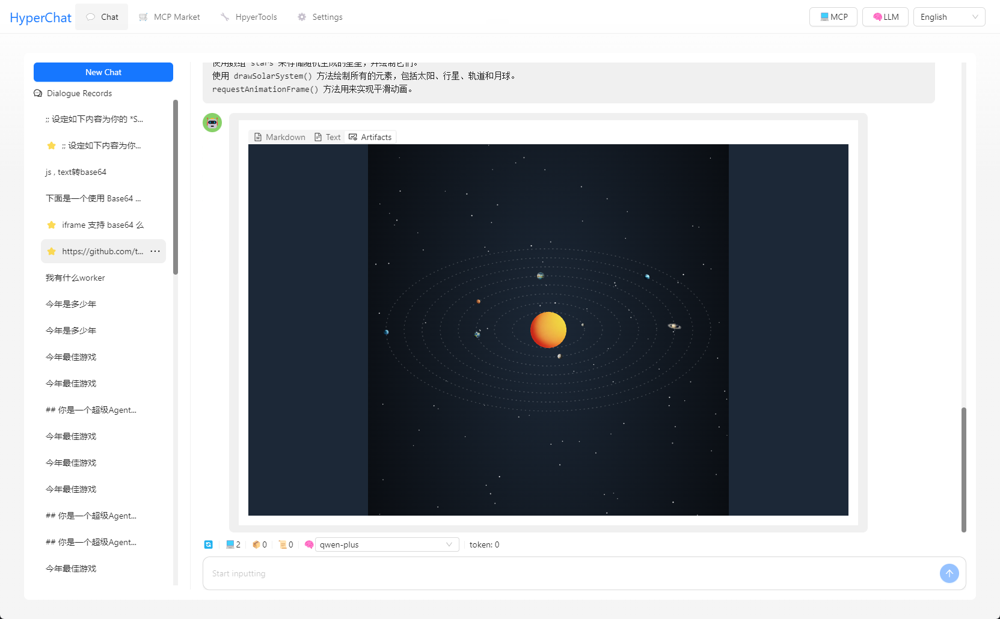

[中文](README.zh.md) | [English](README.md)


## Introduction

HyperChat is a Chat client that pursues openness, capable of using APIs from various LLM providers, fully supports MCP, and aims to provide the best Chat experience. It also features productivity MAX tools based on native Agent implementation.

[](https://github.com/BigSweetPotatoStudio/HyperChat/actions/workflows/build.yml)
[](https://www.npmjs.com/package/@dadigua/hyper-chat)
[](https://npm-stat.com/charts.html?package=@dadigua/hyper-chat)

* Supports OpenAI-style LLMs: `OpenAI`, `Claude(OpenRouter)`, `Qwen`, `Deepseek`, `GLM`, `Ollama`.
* Built-in MCP plugin marketplace, user-friendly MCP installation and configuration, one-click installation, and welcome to submit [HyperChatMCP](https://github.com/BigSweetPotatoStudio/HyperChatMCP).
* Also supports manual installation of third-party MCP, just fill in `command`, `args`, `env`.

## DEMO

* [HyperChat](https://hyperchat.dadigua.men/123456/) on Docker

## Features:

- [x] **🪟Windows** + **🍏MacOS** + **Linux**
- [x] Run from command line: `npx -y @dadigua/hyper-chat`, default port 16100, password 123456, Web access at http://localhost:16100/123456/
- [x] Docker 
    * Command line version: `docker pull dadigua/hyperchat-mini:latest`
    * Ubuntu desktop + Chrome + BrowserUse version (**coming soon**)
- [x] `MCP` extension market + third-party MCP support
- [x] Supports free creation and design of `Agent`, can preset prompts and select MCP features
- [x] Supports dark mode 🌙
- [x] Resources, Prompts, Tools support
- [x] Supports English and Chinese
- [x] Supports `Artifacts`, `SVG`, `HTML` rendering, JavaScript error capture, and opens Chrome's console
- [x] Optimized Agent display, supports search, drag-and-drop sorting
- [x] Supports `KaTeX`, displays mathematical formulas, code rendering adds highlighting and quick copy
- [x] `WebDAV` synchronization
- [x] Added `RAG`, based on MCP knowledge base
- [x] Introduced the concept of ChatSpace, supports multiple dialogues concurrently
- [x] Supports Agent Call Agent via HyperAgent's MCP
- [x] Added scheduled tasks to specify Agents to complete tasks at scheduled times and check task completion status.

### TODO:

- [ ] Future updates will include a Docker version with built-in Linux desktop, built-in Chrome configuration for remote ports, unified environment for easier usage, and web interface control. It will be usable on any device, including phones. 🤣
- [ ] Permission pop-up, whether to allow
- [ ] Implement LLM to write its own MCP.

### LLM

| LLM      | Usability   | Notes                         |
| -------- | -------- | --------------------------- |
| claude   | ⭐⭐⭐⭐⭐  | Need not explain                    |
| openai   | ⭐⭐⭐⭐⭐ | Also perfectly supports multi-step function calls (gpt-4o-mini can also) |
| gemini flash 2.0   | ⭐⭐⭐⭐🌙 | Very usable |
| qwen       | ⭐⭐⭐⭐🌙    | Very usable                 |
| doubao       | ⭐⭐⭐🌙🌙    | Feels okay to use                   |
| deepseek | ⭐⭐⭐🌙🌙      | Multi-step function calls may have issues       |

## Usage

* 1. Configure APIKEY, ensure your LLM service is compatible with OpenAI style.
* 2. Ensure you have `uv + nodejs` installed on your system.

### [uvx & uv](https://github.com/astral-sh/uv)

Install using the command line or check the official GitHub tutorial [uv](https://github.com/astral-sh/uv)

```
# MacOS
brew install uv
# Windows
winget install --id=astral-sh.uv  -e
```
### [npx & nodejs](https://nodejs.org/en)

Install using the command line or download from the official website, [nodejs](https://nodejs.org/en)
```
# MacOS
brew install node
# Windows
winget install OpenJS.NodeJS.LTS
```

## Development

```
cd electron && npm install
cd web && pnpm install
npm install
npm run dev
```

## Telegram

[HyperChat User Communication](https://t.me/dadigua001)

#### Supports clicking tool names for direct debugging


#### MCP allows prompt + dynamically modify LLM call Tool parameters


#### Call terminal MCP to automatically analyze asar files + help with extraction


#### Open the terminal view


#### Gaode Map MCP


#### One-click webpage creation and publish to (cloudflare)


#### Call Google Search to ask what the TGA Game of the Year is


#### What are the free games available for a limited time, please visit the website and call the tool


#### Help you open webpages, analyze results, and write to files


#### Use web tools + command line tools to open GitHub README for learning + GIT clone + set up development environment


#### Scheduled task list


#### Install third-party MCP (supports any MCP)


#### Third-party MCP installation interface


#### MCP list (can be selected dynamically)


#### Render HTML, supports `Artifacts`, `SVG`, `HTML` rendering,


#### Interface 1


#### Interface 2


#### Interface 3, testing model capabilities


#### Knowledge Base


## Disclaimer

* This project is for learning and communication purposes only. If you use this project for any activities, such as crawling behaviors, etc., it has nothing to do with the developers of this project.