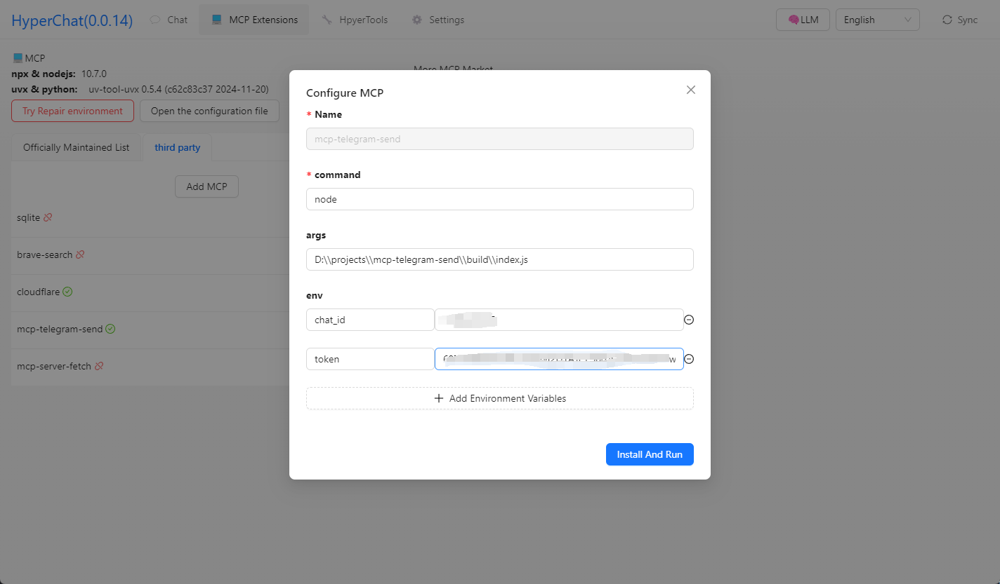

[中文](README.zh.md) | [English](README.md)


## Features

HyperChat is an open-minded Chat client that can use APIs from various LLMs to achieve the best Chat experience and implement productivity tools through the MCP protocol.

* Supports OpenAI-style LLMs, `OpenAI`, `Claude(OpenRouter)`, `Qwen`, `Deepseek`, `GLM`, `Ollama`.
* Built-in MCP plugin marketplace with user-friendly installation and configuration for MCP, one-click installation, and contributions to [HyperChatMCP](https://github.com/BigSweetPotatoStudio/HyperChatMCP) are welcome.
* Also supports manual installation of third-party MCPs, just fill in `command`, `args`, `env`.

### MCP:

[](https://github.com/BigSweetPotatoStudio/HyperChat/actions/workflows/build.yml)

- [x] 🪟Windows + 🍏MacOS
- [x] Supports dark mode🌙
- [x] Supports `nvm`, see below
- [x] Supports Resources, Prompts, Tools
- [x] Supports both English and Chinese
- [x] Added built-in MCP client `hypertools`, `fetch` + `search`
- [x] Supports `Agent`, allowing preset prompts and permissible MCP services
- [x] Supports `Artifacts`, `SVG`, `HTML` rendering, js error capture, and supports opening Chrome's console
- [x] Agent display optimization, supports search and drag-and-drop sorting
- [x] Supports `KaTeX`, displaying mathematical formulas, code highlighting and quick copy
- [x] `WebDAV` synchronization
- [x] MCP extension market + third-party MCP support
- [x] Added `RAG`, based on the MCP knowledge base
- [x] Introduced the ChatSpace concept, supporting multiple conversations simultaneously
- [x] Supports Agent Call Agent through HyperAgent's MCP
- [x] Added scheduled tasks, designating agents to complete tasks on schedule and check task completion status.


### TODO:

- [ ] Permission pop-up, to allow or not
- [ ] Implement LLMs writing tools for themselves
- [ ] Local `shell` + `nodejs` + `js on web` runtime environment

### LLM

| LLM      | Usability   | Remarks                         |
| -------- | ------- | ---------------------------- |
| claude   | ⭐⭐⭐⭐⭐   | No explanation                |
| openai   | ⭐⭐⭐⭐⭐  | Also supports multi-step function call perfectly (gpt-4o-mini also works) |
| gemini flash 2.0   | ⭐⭐⭐⭐🌙 | Very usable                  |
| qwen       | ⭐⭐⭐⭐🌙    | Very usable                  |
| doubao       | ⭐⭐⭐    | Feels okay to use             |
| deepseek | ⭐⭐      | Multi-step function call may have issues |

## Usage

* 1. Configure APIKEY, ensuring your LLM service is compatible with the OpenAI style.
* 2. Ensure that `uv + nodejs` is installed on your system.

### [uvx & uv](https://github.com/astral-sh/uv)

Install using the command line, or check the official GitHub tutorial [uv](https://github.com/astral-sh/uv)

```
# MacOS
brew install uv
# Windows
winget install --id=astral-sh.uv  -e
```

### [npx & nodejs](https://nodejs.org/en)

Install using the command line, or download and install from the official site, [nodejs](https://nodejs.org/en)
```
# MacOS
brew install node
# Windows
winget install OpenJS.NodeJS.LTS
```

## Development

```
cd electron && npm install
cd web && npm install
npm install
npm run dev
```

## Note

* MacOS encounters damage or permission issues, `sudo xattr -d com.apple.quarantine /Applications/HyperChat.app`
* MacOS `nvm` users need to manually enter PATH `echo $PATH`, windows version `nvm` seems to be usable directly


## Telegram

[HyperChat User Communication](https://t.me/dadigua001)





## Disclaimer

* This project is for learning and communication purposes only. If you use this project for any operations, such as web scraping, etc., the project developers are not responsible.