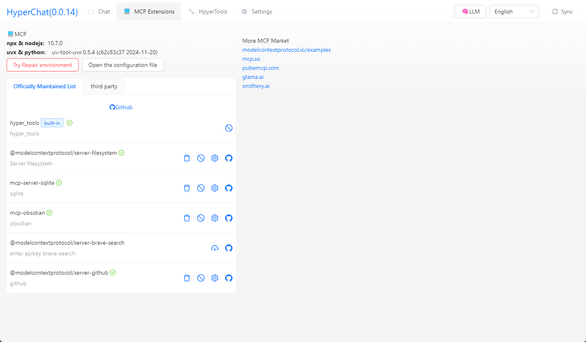

[中文](README.zh.md) | [English](README.md)


## Introduction

HyperChat is a Chat client that pursues openness, capable of using APIs from various LLMs, fully supports MCP, and provides the best Chat experience. It also implements a productivity MAX tool based on a native Agent.

[](https://github.com/BigSweetPotatoStudio/HyperChat/actions/workflows/build.yml)
[](https://www.npmjs.com/package/@dadigua/hyper-chat)
[](https://npm-stat.com/charts.html?package=@dadigua/hyper-chat)

* Supports OpenAI-style LLMs: `OpenAI`, `Claude(OpenRouter)`, `Qwen`, `Deepseek`, `GLM`, `Ollama`.
* Built-in MCP plugin market, user-friendly installation and configuration of MCP, one-click installation, and contributions to [HyperChatMCP](https://github.com/BigSweetPotatoStudio/HyperChatMCP) are welcome.
* Also supports manual installation of third-party MCPs, simply fill in `command`, `args`, and `env` to get started.

## DEMO

* [HyperChat](https://hyperchat.dadigua.men/123456/) on Docker

## Features:

- [x] **🪟Windows** + **🍏MacOS** + **Linux**
- [x] Command line execution, `npx -y @dadigua/hyper-chat`, default port 16100, password 123456, Web access http://localhost:16100/123456/
- [x] Docker 
    * Command line version `docker pull dadigua/hyperchat-mini:latest`
    * Ubuntu desktop + Chrome + BrowserUse version (**coming soon**)
- [x] `MCP` extension market + support for third-party MCPs
- [x] Supports free creation and design of `Agent`, with pre-set prompts and selection of MCP features
- [x] Supports dark mode 🌙
- [x] Resources, Prompts, Tools support
- [x] Supports English and Chinese
- [x] Supports `Artifacts`, `SVG`, `HTML` rendering, JavaScript error capturing, supports opening Chrome's console
- [x] Agent display optimization, supports search, drag-and-drop sorting
- [x] Supports `KaTeX`, displaying mathematical formulas, code rendering enhanced with highlighting and quick copy
- [x] `WebDAV` synchronization
- [x] Added `RAG`, based on MCP knowledge base
- [x] Added ChatSpace concept, supporting multiple conversations simultaneously
- [x] Supports Agent Call Agent through HyperAgent's MCP
- [x] Added Scheduled Tasks, allowing agents to complete tasks on schedule and check task status.

### TODO:

- [ ] Later will add a Docker version, with built-in Linux desktop, built-in Chrome configuration for remote ports, unifying the environment for easier use, and web interface control. It can be used on any device, including mobile phones 🤣
- [ ] Permissions pop-up, to allow or disallow
- [ ] Implement LLM to write MCP for itself

### LLM

| LLM      | Usability    | Notes                         |
| -------- | ------ | ---------------------------- |
| claude   | ⭐⭐⭐⭐⭐  | No explanation required       |
| openai   | ⭐⭐⭐⭐⭐ | Perfectly supports multi-step function calls (gpt-4o-mini also works) |
| gemini flash 2.0   | ⭐⭐⭐⭐🌙 | Very usable                  |
| qwen       | ⭐⭐⭐⭐🌙    | Very usable                  |
| doubao       | ⭐⭐⭐🌙🌙    | Feels okay to use            |
| deepseek | ⭐⭐⭐🌙🌙      | Multi-step function calls can have issues |

## Usage

* 1. Configure APIKEY, ensure your LLM service is compatible with OpenAI style.
* 2. Ensure you have `uv + nodejs` installed on your system.

### [uvx & uv](https://github.com/astral-sh/uv)

Install via command line or check the official GitHub tutorial [uv](https://github.com/astral-sh/uv)

```
# MacOS
brew install uv
# Windows
winget install --id=astral-sh.uv  -e
```
### [npx & nodejs](https://nodejs.org/en)

Install via command line or download it from the official site, [nodejs](https://nodejs.org/en)
```
# MacOS
brew install node
# Windows
winget install OpenJS.NodeJS.LTS
```

## Development

```
cd electron && npm install
cd web && pnpm install
npm install
npm run dev
```

## Note

* MacOS encountered damage or permission issues, `sudo xattr -d com.apple.quarantine /Applications/HyperChat.app`
* MacOS `nvm` users manually input PATH `echo $PATH`, Windows version of `nvm` seems to work directly


## Telegram

[HyperChat User Communication](https://t.me/dadigua001)

#### Call shell mcp


#### Call terminal mcp, ssh + can also execute commands


#### One-click write webpage and publish to (cloudflare)


#### Call Google Search to ask what TGA Game of the Year is


#### Organize Zhihu Hot Searches


#### Open webpage for you, analyze results, and write to file


#### Open Baidu and take a screenshot


#### Scheduled Tasks List


#### MCP Market (Experimental)


#### Install MCP interface from market (Experimental)


#### Install MCP from third-party (supports any MCP)


#### Install MCP interface from third-party


#### MCP List (can select dynamically)


#### Render HTML, supports `Artifacts`, `SVG`, `HTML` rendering,


#### Interface 1


#### Interface 2


#### Interface 3, testing model capabilities


#### Knowledge Base


## Disclaimer

* This project is for learning and communication purposes only. If you use this project for any operations, such as web scraping, it is unrelated to the developers of this project.