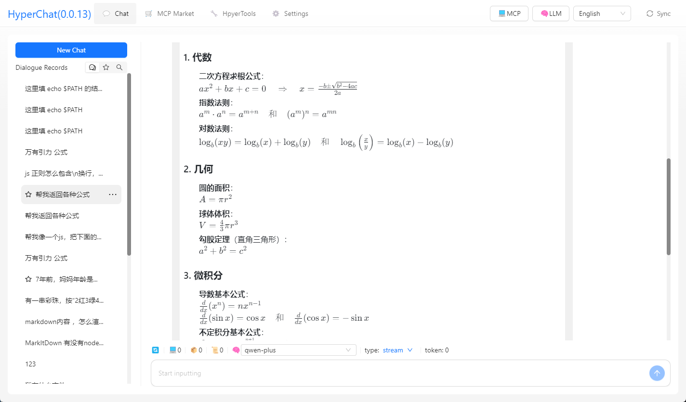

[中文](README.zh.md) | [English](README.md)


## Features

HyperChat is an open Chat client that utilizes the APIs of various LLMs to provide the best Chat experience and to implement productivity tools via the MCP protocol.

* Supports OpenAI-style LLMs, `OpenAI`, `Claude(OpenRouter)`, `Qwen`, `Deepseek`, `GLM`, `Ollama`.
* Built-in MCP plugin market with user-friendly MCP installation and configuration, one-click installation, welcome to submit [HyperChatMCP](https://github.com/BigSweetPotatoStudio/HyperChatMCP).
* Also supports manual installation of third-party MCPs by filling in `command`, `args`, `env`.

### MCP: 

[](https://github.com/BigSweetPotatoStudio/HyperChat/actions/workflows/build.yml)

- [x] 🪟Windows+🍏MacOS
- [x] Supports `nvm`, see below
- [x] Resources support
- [x] Partial support for Prompts
- [x] Tools support
- [x] Supports English and Chinese
- [x] Added built-in MCP client `hypertools`, `fetch` + `search`
- [x] Supports `Agent`, allows preset prompts, permissible MCP services
- [x] Supports `Artifacts`, `SVG`, `HTML` rendering, JS error capturing, supports opening Chrome's console
- [x] Agent display optimization, supports searching, drag-and-drop sorting
- [x] Supports `KaTeX`, displays mathematical formulas, code rendering with added highlighting and quick copy
- [x] `WebDAV` synchronization
- [x] `MCP` extension market + third-party MCP support
- [x] Added `RAG`, based on MCP knowledge base
- [x] Introduced ChatSpace concept, supports multiple conversations simultaneously
- [x] Supports Agent Call Agent through HyperAgent’s MCP

### TODO:

- [ ] Permission pop-up, whether to allow
- [ ] Add task, HyperAgent concept, support for scheduled tasks. Manage Task through HyperAgent.
- [ ] Implement using LLM to write Tools for itself
- [ ] Local `shell` + `nodejs` + `js on web` runtime environment

### LLM

| LLM      | Usability    | Remarks                         |
| -------- | ------ | ---------------------------- |
| claude   | ⭐⭐⭐⭐⭐  | No explanation                    |
| openai   | ⭐⭐⭐⭐🌙 | Also perfectly supports multi-step function calls (gpt-4o-mini can too) |
| qwen     | ⭐⭐⭐⭐🌙 | Very user-friendly, feels better than OpenAI  |
| doubao   | ⭐⭐⭐    | Feels okay to use                   |
| deepseek | ⭐⭐      | Multi-step function calls may have issues       |

## Usage

* 1. Configure APIKEY, ensure your LLM service is compatible with OpenAI style.
* 2. Ensure you have `uv + nodejs` installed in your system.

### [uvx & uv](https://github.com/astral-sh/uv)

Install using the command line, or check the official GitHub tutorial [uv](https://github.com/astral-sh/uv)

```
# MacOS
brew install uv
# Windows
winget install --id=astral-sh.uv  -e
```
### [npx & nodejs](https://nodejs.org/en)

Install using the command line, or download from the official website, [nodejs](https://nodejs.org/en)
```
# MacOS
brew install node
# Windows
winget install OpenJS.NodeJS.LTS
```

## Development

```
cd electron && npm install
cd web && npm install
npm install
npm run dev
```

## Notes

* MacOS encountering damage or permission issues, `sudo xattr -d com.apple.quarantine /Applications/HyperChat.app`
* MacOS `nvm` users manually input PATH `echo $PATH`, Windows version `nvm` seems to be available directly


## Telegram

[HyperChat User Group](https://t.me/dadigua001)





## Disclaimer

* This project is for learning and communication purposes only. If you use this project for any operations, such as web scraping, it has no relation to the developers of this project.