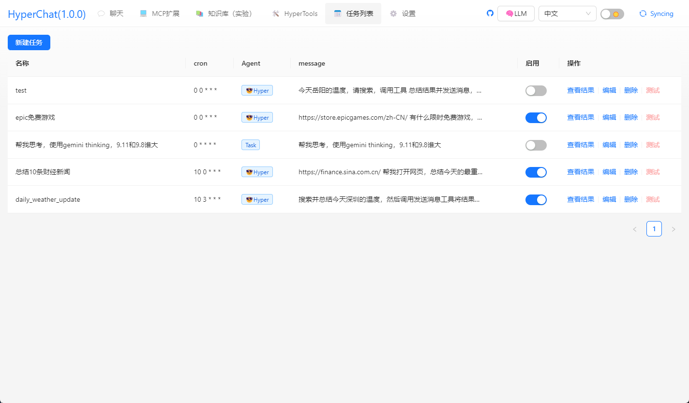

[中文](README.zh.md) | [English](README.md)


## Introduction

HyperChat is an open pursuit Chat client that can use APIs from various LLMs, fully supporting MCP to achieve the best chat experience, as well as a production MAX tool based on native Agents.

[](https://github.com/BigSweetPotatoStudio/HyperChat/actions/workflows/build.yml)
[](https://www.npmjs.com/package/@dadigua/hyper-chat)
[](https://npm-stat.com/charts.html?package=@dadigua/hyper-chat)

* Supports OpenAI-style LLMs, `OpenAI`, `Claude(OpenRouter)`, `Qwen`, `Deepseek`, `GLM`, `Ollama`.
* Built-in MCP plugin marketplace, user-friendly MCP installation configuration, one-click installation. Contributions to [HyperChatMCP](https://github.com/BigSweetPotatoStudio/HyperChatMCP) are welcome.
* Also supports manual installation of third-party MCPs; just fill in `command`, `args`, `env`.

## DEMO

* [HyperChat](https://hyperchat.dadigua.men/123456/) on Docker

## Features:

- [x] **🪟Windows** + **🍏MacOS** + **Linux**
- [x] Command line execution, `npx -y @dadigua/hyper-chat`, default port 16100, password 123456, Web access http://localhost:16100/123456/
- [x] Docker 
    * Command line version `docker pull dadigua/hyper-chat-mini:1.2.8`
    * Ubuntu desktop + Chrome + BrowserUse version (**coming soon**)
- [x] `MCP` extension marketplace + third-party MCP support
- [x] Supports free creation and design of `Agent`, with preset prompts and selection of MCP features
- [x] Supports dark mode🌙
- [x] Resources, Prompts, Tools support
- [x] Supports English and Chinese
- [x] Supports `Artifacts`, `SVG`, `HTML` rendering, js error capture, and opening the Chrome console
- [x] Agent display optimization, supports searching and drag-and-drop sorting
- [x] Supports `KaTeX`, displays mathematical formulas, code rendering adding highlighting and quick copy
- [x] `WebDAV` synchronization
- [x] Adds `RAG`, based on the MCP knowledge base
- [x] Introduces the ChatSpace concept, supports multi-dialogue chatting simultaneously
- [x] Supports Agent Call Agent through HyperAgent's MCP
- [x] Adds scheduled tasks, specifying Agent to complete tasks on time, and view task completion status.

### TODO:

- [ ] Future versions will include a docker version, integrated Linux desktop, built-in Chrome configuration for remote ports, unified environment, better usability, and web interface control. Usable on any device, including mobile phones.🤣
- [ ] Permission pop-up, allow or not
- [ ] Implement using LLM to write MCP for itself

### LLM

| LLM                | Usability    | Notes                         |
| ------------------ | ------------ | ----------------------------- |
| claude             | ⭐⭐⭐⭐⭐       | No explanation                |
| openai             | ⭐⭐⭐⭐⭐       | Can also perfectly support multi-step function calls (gpt-4o-mini can also) |
| gemini flash 2.0   | ⭐⭐⭐⭐🌙      | Very usable                   |
| qwen               | ⭐⭐⭐⭐🌙      | Very usable                   |
| doubao             | ⭐⭐⭐🌙🌙      | Feels okay to use             |
| deepseek           | ⭐⭐⭐🌙🌙      | Multi-step function calls may have issues |

## Usage

* 1. Configure APIKEY, make sure your LLM service is compatible with OpenAI style.
* 2. Ensure your system has `uv + nodejs` installed.

### [uvx & uv](https://github.com/astral-sh/uv)

Install using the command line, or check the official GitHub tutorial [uv](https://github.com/astral-sh/uv)

```
# MacOS
brew install uv
# windows
winget install --id=astral-sh.uv -e
```
### [npx & nodejs](https://nodejs.org/en)

Install using the command line, or download from the official site, official [nodejs](https://nodejs.org/en)
```
# MacOS
brew install node
# windows
winget install OpenJS.NodeJS.LTS
```

## Development

```
cd electron && npm install
cd web && pnpm install
npm install
npm run dev
```

## Note

* MacOS encounters a damaged or permission issue, `sudo xattr -d com.apple.quarantine /Applications/HyperChat.app`
* MacOS `nvm` users manually input PATH `echo $PATH`, the Windows version `nvm` seems to work directly


## Telegram

[HyperChat User Communication](https://t.me/dadigua001)

#### Call shell mcp


#### Call terminal mcp, ssh + can execute commands


#### One-click webpage generation and publish to (cloudflare)


#### Call Google search, ask it what the TGA Game of the Year is


#### Organize Zhihu hot searches


#### Helps you open a webpage, analyze results, and write to a file


#### Open Baidu and take screenshots


#### Scheduled task list


#### MCP market (experimental)


#### Install MCP interface from the market (experimental)


#### Install MCP from third parties (supports any MCP)


#### Install MCP interface from third parties


#### MCP list (can be dynamically selected)


#### Render HTML, supports `Artifacts`, `SVG`, `HTML` rendering,


#### Interface 1


#### Interface 2


#### Interface 3, testing model capabilities


#### Knowledge Base


## Disclaimer

* This project is for learning and communication purposes only. If you carry out any operations, such as web scraping, using this project, it is not related to the developers of this project.