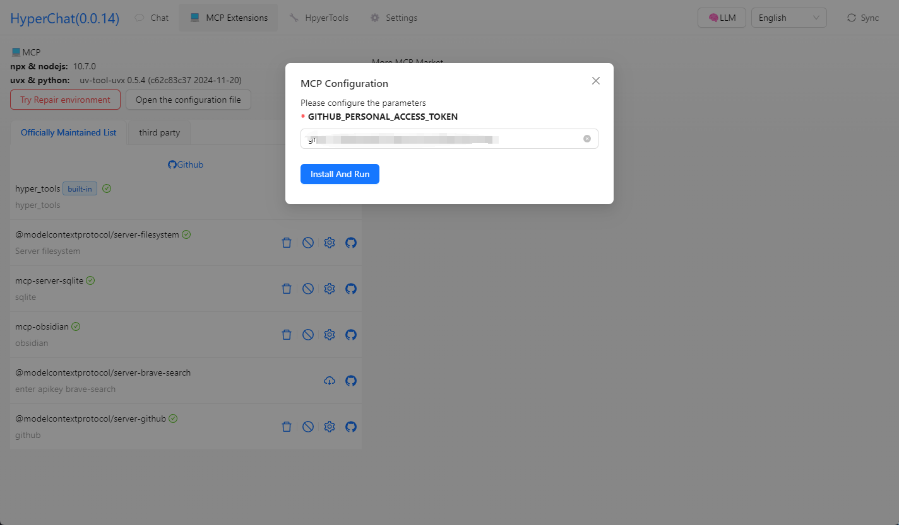

[中文](README.zh.md) | [English](README.md)


## Features

HyperChat is an open-minded Chat client that can use various LLM APIs to provide the best chat experience, as well as implement productivity tools through the MCP protocol.

* Supports OpenAI-style LLMs, `OpenAI`, `Claude(OpenRouter)`, `Qwen`, `Deepseek`, `GLM`, `Ollama`.
* Built-in MCP plugin marketplace, user-friendly installation and configuration of MCP, one-click installation, and welcome to submit [HyperChatMCP](https://github.com/BigSweetPotatoStudio/HyperChatMCP).
* Also supports manual installation of third-party MCP, just fill out `command`, `args`, `env`.

### MCP:

[](https://github.com/BigSweetPotatoStudio/HyperChat/actions/workflows/build.yml)

- [x] 🪟Windows + 🍏MacOS
- [x] Supports `nvm`, see below
- [x] Supports Resources
- [x] Partial support for Prompts
- [x] Supports Tools
- [x] Supports English and Chinese
- [x] Added built-in MCP client `hypertools`, `fetch` + `search`
- [x] Supports `Bot`, can preset prompt words, allowed MCP services
- [x] Supports `Artifacts`, `SVG`, `HTML` rendering, JavaScript error capture, supports opening Chrome console
- [x] Bot display optimization, supports searching, dragging to sort
- [x] Supports `KaTeX`, displays mathematical formulas, code rendering enhances highlighting and quick copy
- [x] `WebDAV` synchronization
- [x] `MCP` extension marketplace + third-party MCP support
- [x] Added knowledge base

### TODO:

- [ ] Permission pop-up, allow or not
- [ ] Support scheduled tasks
- [ ] Support Projects + RAG
- [ ] Implement tools that use LLM to write for itself
- [ ] Local `shell` + `nodejs` + `js on web` runtime environment

### LLM

| LLM      | Ease of Use | Notes                       |
| -------- | ----------- | --------------------------- |
| claude   | ⭐⭐⭐⭐⭐      | No explanation               |
| openai   | ⭐⭐⭐⭐🌙    | Can also perfectly support multi-step function calls (gpt-4o-mini can too) |
| qwen     | ⭐⭐⭐⭐🌙    | Very usable, feels better than OpenAI |
| doubao   | ⭐⭐⭐        | Feels okay to use            |
| deepseek | ⭐⭐         | Multi-step function calls may have issues |

## Usage

* 1. Configure APIKEY, ensure your LLM service is compatible with OpenAI style.
* 2. Ensure you have `uv + nodejs` installed on your system.

### [uvx & uv](https://github.com/astral-sh/uv)

Install using the command line or check the official Github tutorial [uv](https://github.com/astral-sh/uv)

```
# MacOS
brew install uv
# Windows
winget install --id=astral-sh.uv -e
```
### [npx & nodejs](https://nodejs.org/en)

Install using the command line or download from the official website, official [nodejs](https://nodejs.org/en)
```
# MacOS
brew install node
# Windows
winget install OpenJS.NodeJS.LTS
```

## Development

```
cd electron && npm install
cd web && npm install
npm install
npm run dev
```

## Notes

* On MacOS, if you encounter a damaged or permission issue, use `sudo xattr -d com.apple.quarantine /Applications/HyperChat.app`
* For MacOS `nvm` users, manually input the PATH `echo $PATH`, Windows version of `nvm` seems to work directly


## Telegram

[HyperChat User Community](https://t.me/dadigua001)





