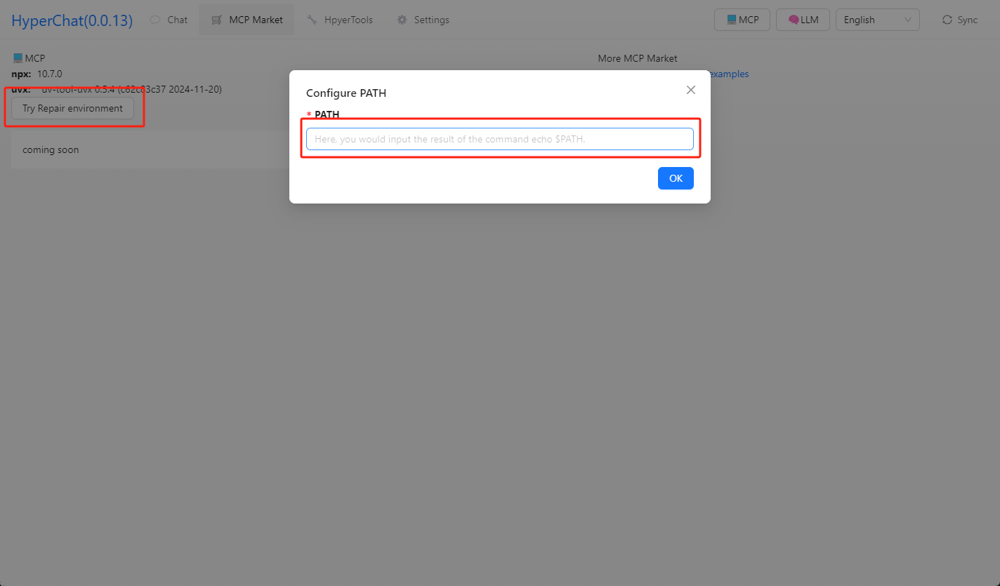
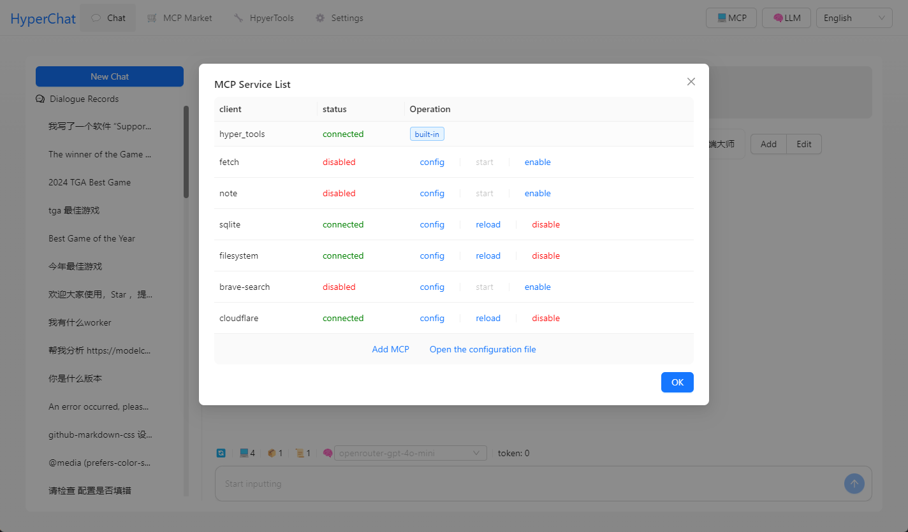
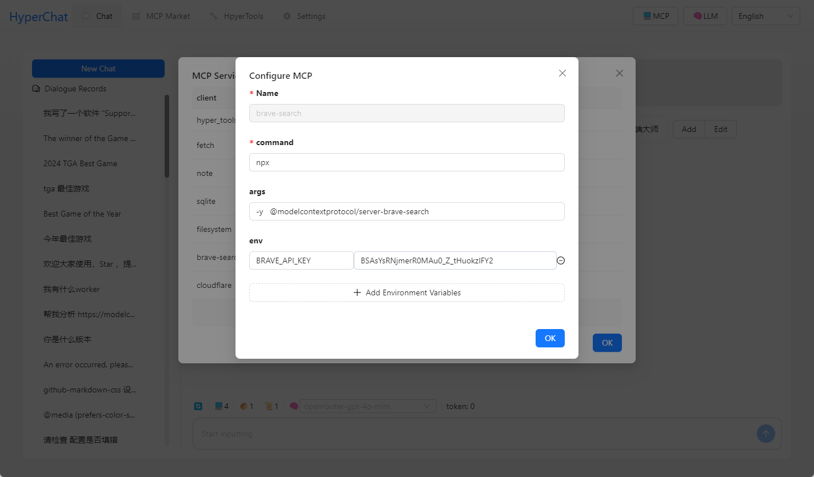

## 功能

HyperChat 是一个追求开放的Chat客户端，可以使用各家LLM的API，实现最好的Chat体验，以及实现生产力工具通过MCP协议。

支持 [MCP](https://modelcontextprotocol.io/introduction) 协议的Chat，使用类OpenAI的协议，兼容 `Claude Desktop` 配置文件。支持 `Client` 热加载，重启，禁用。

### MCP: 

[](https://github.com/BigSweetPotatoStudio/HyperChat/actions/workflows/build.yml)

- [x] 🪟Windows+🍏MacOS
- [x] 支持 `nvm`, 看下面
- [x] Resources 支持
- [x] Prompts 部分支持
- [x] Tools 支持
- [x] 支持英文和中文
- [x] 添加了内置的MCP客户端`hypertools`, `fetch`+`search`
- [x] 支持 `Bot`，可以预设提示词，允许的MCP服务
- [x] 支持 `Artifacts`, `HTML`,`SVG` 渲染
- [x] Bot显示优化，支持查找，拖拽排序
- [x] 支持 `KaTeX`，显示数学公式
- [x] `WebDAV` 同步

### TODO:

- [ ] 权限弹窗，是否允许
- [ ] 支持定时任务
- [ ] 支持Projects + RAG
- [ ] 实现利用LLM自己给自己写Tools
- [ ] 本地的`shell`+`nodejs`+`js on web`运行环境

### LLM

| LLM      | 好用度    | 备注                         |
| -------- | ------ | -------------------------- |
| claude   | ⭐⭐⭐⭐⭐  | 不解释                    |
| openai   | ⭐⭐⭐⭐🌙 | 也可以完美支持多步function call(gpt-4o-mini也可以) |
| qwen       | ⭐⭐⭐⭐🌙    | 很好用，感觉比openai更好                 |
| doubao       | ⭐⭐⭐    | 使用起来感觉还行                   |
| deepseek | ⭐⭐      | 多步function call会出问题       |

## 使用

* 1.配置APIKEY，确保你的LLM服务兼容OpenAI风格。
* 2.确保您的系统中已安装 `uv + nodejs`。

### [uvx](https://github.com/astral-sh/uv)

```
# MacOS
brew install uv
```
### [npx & nodejs](https://nodejs.org/en)

```
# MacOS
brew install node 
```

## 开发

```
cd electron && npm install
cd web && npm install
npm install
npm run dev
```


## 注意

* MacOS 遇到了已损坏或者权限问题， `sudo xattr -d com.apple.quarantine /Applications/HyperChat.app`
* MacOS `nvm` 用户 手动输入PATH `echo $PATH`, windows版本 `nvm` 好像可以直接使用




## Telegram

[HyperChat用户交流](https://t.me/dadigua001)







