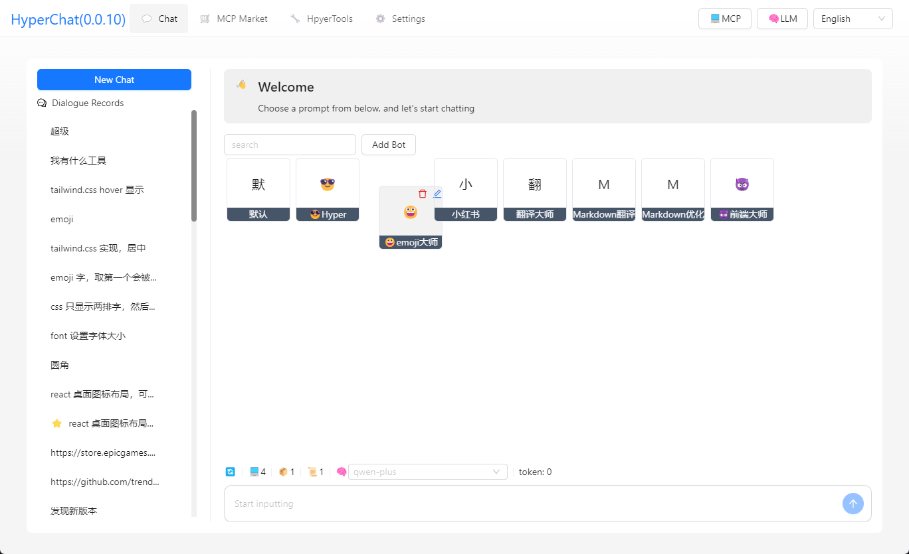

## 简介

HyperChat 是一个追求开放的Chat客户端，可以使用各家LLM的API，完全支持MCP，实现最好的Chat体验。以及基于本机Agent实现生产力MAX工具。

[](https://github.com/BigSweetPotatoStudio/HyperChat/actions/workflows/build.yml)
[](https://www.npmjs.com/package/@dadigua/hyper-chat)
[](https://npm-stat.com/charts.html?package=@dadigua/hyper-chat)


* 支持 OpenAI风格的LLM，`OpenAI` , `Claude(OpenRouter)`, `Qwen`, `Deepseek`, `GLM`, `Ollama` 。
* 内置MCP插件市场，人性化的MCP的安装填写配置，一键安装，欢迎提交[HyperChatMCP](https://github.com/BigSweetPotatoStudio/HyperChatMCP)。
* 也支持第三方MCP手动安装，填写 `command` , `args` , `env` 即可。

## DEMO

* [HyperChat](https://hyperchat.dadigua.men/123456/) on Docker

## 功能: 

- [x] **🪟Windows** + **🍏MacOS** + **Linux**
- [x] 命令行运行，`npx -y @dadigua/hyper-chat`，默认端口 16100, 密码 123456, Web访问 http://localhost:16100/123456/
- [x] Docker 
    * 命令行的版本 `docker pull dadigua/hyperchat-mini:latest`
    * Ubuntu桌面 + Chrome + BrowserUse 版本(**coming soon**)
- [x] `MCP`扩展市场+第三方MCP支持
- [x] 支持自由创建，设计`Agent`，可以预设提示词，选择MCP功能
- [x] 支持暗黑模式🌙
- [x] Resources，Prompts，Tools 支持
- [x] 支持英文和中文
- [x] 支持 `Artifacts`, `SVG`,`HTML` 渲染, js错误捕获，支持打开Chrome的控制台
- [x] Agent显示优化，支持查找，拖拽排序
- [x] 支持 `KaTeX`，显示数学公式，代码Code渲染增加高亮和快速复制
- [x] `WebDAV` 同步
- [x] 添加`RAG`，基于mcp知识库
- [x] 添加ChatSpace概念，支持多对话同时聊天
- [x] 支持 Agent Call Agent，通过HyperAgent的MCP
- [x] 添加定时任务，指定Agent定时完成任务，以及任务完成情况查看。


### TODO:

- [ ] 后续会加入docker版本，内置linux桌面，内置chomre配置romote端口，统一了环境，更好搞。然后web界面控制。在任何设备都可以使用，包括手机🤣
- [ ] 权限弹窗，是否允许
- [ ] 实现利用LLM自己给自己写MCP

### LLM

| LLM      | 好用度    | 备注                         |
| -------- | ------ | -------------------------- |
| claude   | ⭐⭐⭐⭐⭐  | 不解释                    |
| openai   | ⭐⭐⭐⭐⭐ | 也可以完美支持多步function call(gpt-4o-mini也可以) |
| gemini flash 2.0   | ⭐⭐⭐⭐🌙 |  很好用 |
| qwen       | ⭐⭐⭐⭐🌙    | 很好用                 |
| doubao       | ⭐⭐⭐🌙🌙    | 使用起来感觉还行                   |
| deepseek | ⭐⭐⭐🌙🌙      | 多步function call会出问题       |

## 使用

* 1.配置APIKEY，确保你的LLM服务兼容OpenAI风格。
* 2.确保您的系统中已安装 `uv + nodejs`。

### [uvx & uv](https://github.com/astral-sh/uv)

使用命令行安装，或者去看官方Github教程 [uv](https://github.com/astral-sh/uv)

```
# MacOS
brew install uv
# windows
winget install --id=astral-sh.uv  -e
```
### [npx & nodejs](https://nodejs.org/en)

使用命令行安装，或者去官网下载安装，官网 [nodejs](https://nodejs.org/en)
```
# MacOS
brew install node
# windows
winget install OpenJS.NodeJS.LTS
```

## 开发

```
cd electron && npm install
cd web && pnpm install
npm install
npm run dev
```

## Telegram

[HyperChat用户交流](https://t.me/dadigua001)

#### 支持点击tool名称，直接调用调试


#### mcp允许提示+动态修改LLM调用Tool的参数


#### 调用terminal mcp  自动帮我分析asar文件 + 帮我解压


#### 调用terminal 查看界面


#### 高德地图MCP


#### 一键写网页，并发布到（cloudflare）


#### 调用谷歌搜索，问他TGA年度游戏是什么


#### 有什么限时免费游戏，请访问网址，调用工具


#### 帮你打开网页，分析结果，并写入文件


#### 通过网页工具+命令行工具，打开Github README学习 + GIT克隆 + 搭建开发黄金


#### 定时任务列表


#### 从第三方安装mcp（支持任意mcp）


#### 从第三方安装mcp界面


#### mcp列表（可以动态选择）


#### 渲染HTML，支持 `Artifacts`, `SVG`,`HTML` 渲染,


#### 界面1


#### 界面2


#### 界面3，测试模型能力


#### 知识库


## 免责声明

* 本项目仅供学习交流使用，如果您使用本项目进行任何操作，如爬虫行为等，与本项目开发者无关。
