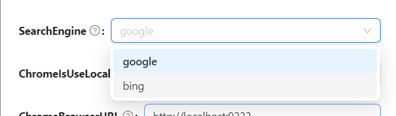

#### HyperChat 内置MCP目前有5个
为了帮助大家使用，以下是内置MCP的详细介绍：

### 1. **hyper_tools**
hypertools 内置3个工具
- current_time: 获取当前时间
- fetch 打开页面，获取页面数据
- search 使用搜索引擎搜索，支持谷歌和必应

#### hyper_tools设置

* Web_Tools_Platform可以设置，使用chrome打开页面，或者electron打开页面，或者禁用关于网页相关的内容。

* SearchEngine，设置搜索引擎，支持谷歌和必应

* 其他还可以设置，是否调用远程的chrome打开网页，等

### 2. **hyper_knowledge_base**
这个是内置知识库相关的mcp，可以通过mcp添加知识库内容，不过，内置的知识库还是实验版本，可以等以后完善。

### 3. **hyper_agent**
