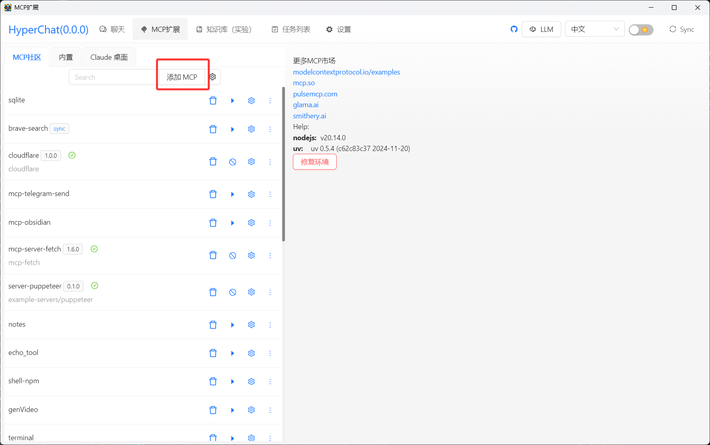
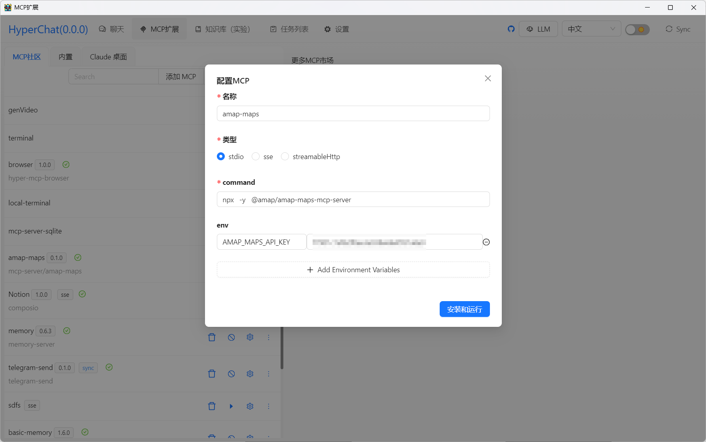
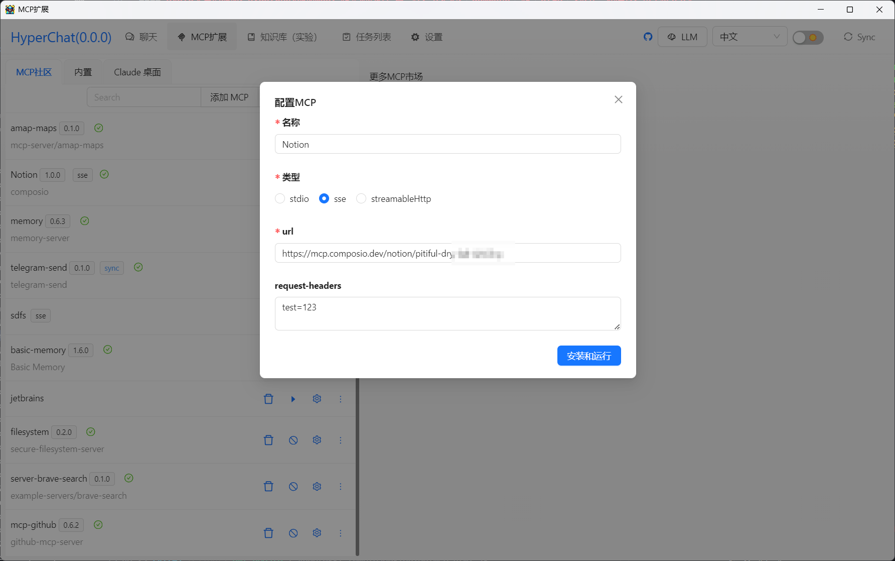
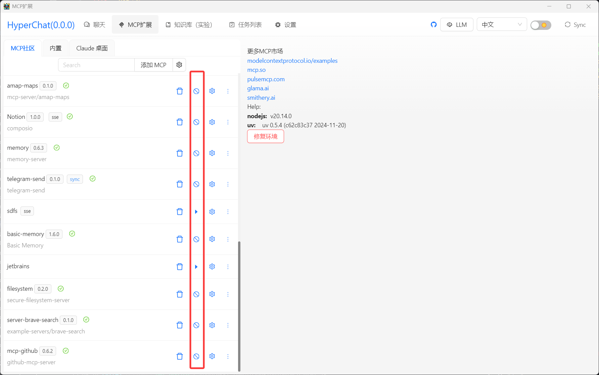
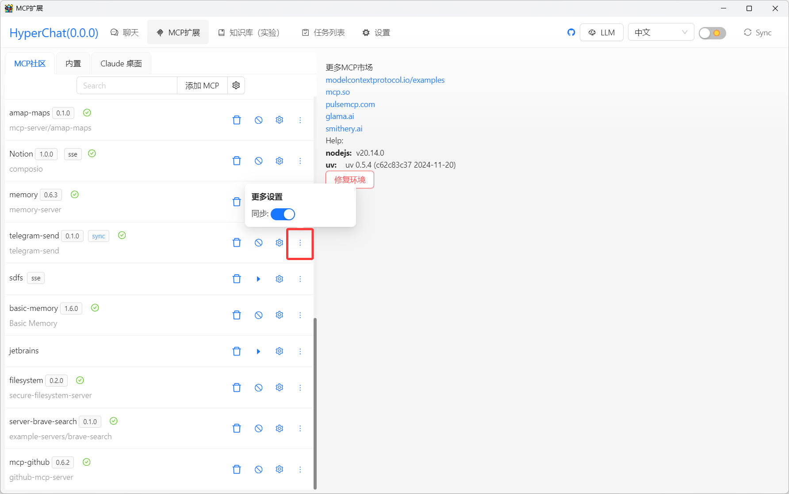

#### HyperChat 安装MCP，支持`stdio`,`sse`,`streamableHttp`，支持启用，禁用，同步MCP。


#### 点击添加


### stdio类型的添加
HyperChat添加mcp，和其他的客户端一样，只是把，`command` 和 `args` ,放在一起填入，用空格分开。如图，一一对应。

```
{
      "command": "npx",
      "args": [
        "-y",
        "@amap/amap-maps-mcp-server"
      ],
      "env": {
        "AMAP_MAPS_API_KEY": "xxxxxxxxxxxxxxxxxxxxxxxxx"
      },
}
```



### `sse`和`streamableHttp`类型的添加




### MCP启用，禁用


### MCP同步
通过MCP，同步这mcp配置


